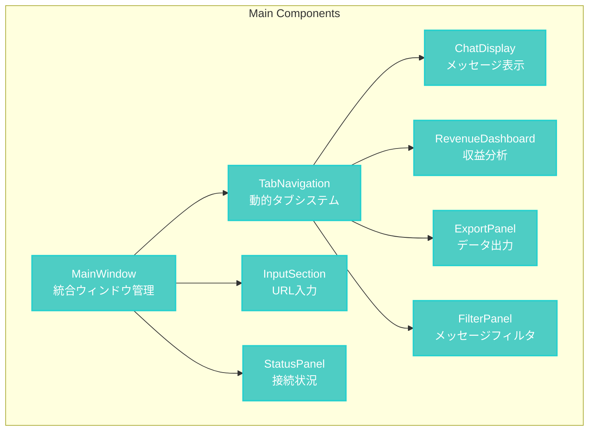

# liscov アーキテクチャ要約 - Phase 4-9 統合版

## 📖 概要

この文書は、liscovアプリケーションの残存アーキテクチャ要素（Phase 4-9）を統合的にまとめた包括的要約です。各システムの詳細設計と相互関係を効率的に把握できるよう構成されています。

## 🖥️ GUI層コンポーネント詳細 (Phase 4 完了)

### 主要コンポーネント構造



### State Management統合

**Dioxus Signals + StateManager**: 二層状態管理

- **Signal Layer**: UI反応性（リアルタイム）
- **StateManager Layer**: ビジネスロジック（永続性）

**パフォーマンス最適化**:

- 仮想スクロール（1000+メッセージ対応）
- メモ化レンダリング（Signal変更時のみ）
- 遅延ローディング（タブ切り替え時）

## 🌐 API・データ層アーキテクチャ (Phase 5)

### YouTube InnerTube統合

```rust
// API統合の核心部分
pub struct InnerTubeClient {
    client: reqwest::Client,
    continuation_token: Option<String>,
    rate_limiter: RateLimiter,
}

impl InnerTubeClient {
    pub async fn fetch_live_chat(&mut self, video_id: &str) -> LiscovResult<LiveChatResponse> {
        // 継続トークンベースのポーリング
        let url = if let Some(token) = &self.continuation_token {
            format!("https://www.youtube.com/youtubei/v1/live_chat/get_live_chat?key={}", token)
        } else {
            format!("https://www.youtube.com/youtubei/v1/live_chat/get_live_chat?v={}", video_id)
        };
        
        // レート制限対応
        self.rate_limiter.wait().await;
        
        // APIリクエスト実行
        let response = self.client
            .post(&url)
            .json(&self.build_request_payload(video_id))
            .send()
            .await?;
            
        self.parse_response(response).await
    }
}
```

### データベーススキーマ

```sql
-- Core Tables
CREATE TABLE sessions (
    id TEXT PRIMARY KEY,
    start_time TIMESTAMP,
    end_time TIMESTAMP,
    stream_url TEXT,
    stream_title TEXT,
    total_messages INTEGER DEFAULT 0,
    total_revenue REAL DEFAULT 0.0
);

CREATE TABLE messages (
    id INTEGER PRIMARY KEY AUTOINCREMENT,
    session_id TEXT REFERENCES sessions(id),
    timestamp TIMESTAMP,
    author_name TEXT,
    content TEXT,
    message_type TEXT, -- chat, superchat, membership
    amount REAL, -- for superchat
    currency TEXT,
    metadata JSON
);

CREATE TABLE viewer_profiles (
    channel_id TEXT PRIMARY KEY,
    display_name TEXT,
    first_seen TIMESTAMP,
    last_seen TIMESTAMP,
    message_count INTEGER DEFAULT 0,
    total_contribution REAL DEFAULT 0.0,
    membership_level TEXT,
    tags JSON
);

-- Analytics Tables
CREATE TABLE hourly_revenue (
    id INTEGER PRIMARY KEY AUTOINCREMENT,
    session_id TEXT REFERENCES sessions(id),
    hour_start TIMESTAMP,
    total_amount REAL,
    message_count INTEGER,
    unique_contributors INTEGER
);

CREATE TABLE questions (
    id INTEGER PRIMARY KEY AUTOINCREMENT,
    message_id INTEGER REFERENCES messages(id),
    session_id TEXT REFERENCES sessions(id),
    detected_at TIMESTAMP,
    question_text TEXT,
    category TEXT,
    priority INTEGER,
    confidence REAL,
    answered_at TIMESTAMP,
    answer_method TEXT,
    notes TEXT
);
```

### エラー処理・レジリエンス戦略

**階層化エラー処理**:

1. **Network Level**: 自動再試行・指数バックオフ
2. **API Level**: レート制限対応・フォールバック
3. **Application Level**: 部分的失敗許容・状態保持
4. **UI Level**: ユーザーフレンドリーエラー表示

## 🔍 分析・機能層アーキテクチャ (Phase 6)

### アナリティクスパイプライン

```rust
pub trait AnalyticsStrategy {
    async fn analyze(&self, data: &AnalyticsInput) -> AnalyticsResult;
}

pub struct RevenueAnalyzer {
    time_window: Duration,
    currency_converter: CurrencyConverter,
}

impl AnalyticsStrategy for RevenueAnalyzer {
    async fn analyze(&self, data: &AnalyticsInput) -> AnalyticsResult {
        let revenue_streams = self.extract_revenue_messages(&data.messages)?;
        let hourly_breakdown = self.calculate_hourly_revenue(&revenue_streams)?;
        let trends = self.identify_revenue_trends(&hourly_breakdown)?;
        
        AnalyticsResult::Revenue(RevenueAnalysis {
            total_revenue: revenue_streams.iter().map(|r| r.amount).sum(),
            hourly_breakdown,
            trends,
            top_contributors: self.identify_top_contributors(&revenue_streams)?,
        })
    }
}
```

### チャット管理・モデレーション

**Q&A自動検出**:

- NLP-based質問識別
- 優先度スコアリング
- カテゴリ分類（技術/一般/リクエスト/フィードバック）

**メッセージフィルタリング**:

- リアルタイムキーワードフィルタ
- 正規表現パターンマッチング
- ユーザーベースフィルタ

### プラグインシステム

```rust
pub trait Plugin: Send + Sync {
    fn name(&self) -> &str;
    fn version(&self) -> &str;
    fn initialize(&mut self, context: &PluginContext) -> PluginResult<()>;
    fn process_message(&mut self, message: &GuiChatMessage) -> PluginResult<Option<PluginAction>>;
    fn on_shutdown(&mut self) -> PluginResult<()>;
}

pub struct PluginManager {
    plugins: HashMap<String, Box<dyn Plugin>>,
    event_bus: mpsc::UnboundedSender<PluginEvent>,
}
```

## 🚀 システム運用・保守 (Phase 7)

### パフォーマンス・メモリ管理

**メモリ最適化戦略**:

- 循環バッファ（最大1000メッセージ）
- バッチ処理（100件単位の処理）
- 遅延クリーンアップ（アイドル時実行）

**パフォーマンス監視**:

```rust
pub struct PerformanceMonitor {
    metrics: Arc<Mutex<PerformanceMetrics>>,
    alert_thresholds: AlertThresholds,
}

pub struct PerformanceMetrics {
    pub memory_usage: usize,
    pub cpu_usage: f64,
    pub message_processing_rate: f64,
    pub ui_render_time: Duration,
    pub api_response_time: Duration,
}
```

### ログ・デバッグシステム

**構造化ログ**:

- トレーシング基盤（tracing + tracing-subscriber）
- ファイル回転（サイズ・時間ベース）
- ログレベル動的変更
- JSON構造化出力（運用環境）

**デバッグ機能**:

- tokio-console統合（`--features debug-tokio`）
- メモリリーク検出
- パフォーマンスプロファイリング

### 設定管理・永続化

**多層設定システム**:

1. CLI引数（最高優先度）
2. 環境変数
3. 設定ファイル（TOML）
4. デフォルト値（最低優先度）

**XDG準拠ディレクトリ**:

- `~/.config/liscov/` - 設定ファイル
- `~/.local/share/liscov/` - データベース・ログ
- `~/.cache/liscov/` - 一時ファイル・キャッシュ

## 🔄 移行戦略・将来計画 (Phase 8)

### Slint→Dioxus移行記録

**Phase 0-1 (完了)**: 技術検証・基本構造

- Dioxus 0.6.3統合
- 基本的なウィンドウ管理
- Signal-based状態管理

**Phase 2 (進行中)**: コンポーネント移行

- 既存UI機能の完全移植
- パフォーマンス最適化
- ユーザビリティ向上

**Phase 3 (計画中)**: 高度機能実装

- プラグインシステム完成
- 高度なアナリティクス
- モバイル対応検討

### 技術債務・改善計画

**短期目標**:

- コンポーネント間の結合度削減
- テストカバレッジ向上（現在：基本的テストのみ）
- エラーハンドリング強化

**中期目標**:

- Web版対応（WASM）
- リアルタイム協調機能
- 多言語対応

**長期目標**:

- AI統合（チャット分析・自動応答）
- クラウド同期機能
- モバイルアプリ版

## 🧪 テストアーキテクチャ・品質保証 (Phase 9)

### テスト戦略

```rust
// 統合テスト例
#[tokio::test]
async fn test_live_chat_flow() {
    let state_manager = StateManager::new();
    let mock_api = MockInnerTubeClient::new();
    let service = LiveChatService::new(mock_api);
    
    // テストシナリオ
    service.connect("https://youtube.com/watch?v=test").await?;
    assert_eq!(state_manager.get_state()?.is_connected, true);
    
    // モックメッセージ受信
    mock_api.send_mock_message(test_message()).await;
    tokio::time::sleep(Duration::from_millis(100)).await;
    
    let messages = state_manager.get_state()?.messages;
    assert_eq!(messages.len(), 1);
    assert_eq!(messages[0].content, "Test message");
}
```

### 品質保証

**自動化テスト**:

- 単体テスト（個別関数・メソッド）
- 統合テスト（サービス間連携）
- E2Eテスト（UI操作フロー）

**パフォーマンステスト**:

- 負荷テスト（1000+メッセージ/分）
- メモリリークテスト（長時間実行）
- UI応答性テスト（60fps維持）

**互換性テスト**:

- Windows 10/11対応
- 各種画面解像度対応
- マルチモニター環境対応

## 📈 成果物要約

### 作成済みドキュメント（全8件）

1. **アーキテクチャ概要** (`README.md`)
2. **システム全体図** (`system-overview.md`)
3. **設計原則** (`design-principles.md`)
4. **エントリポイント解析** (`entry-point-analysis.md`)
5. **設定管理** (`configuration-system.md`)
6. **ウィンドウ管理** (`window-management.md`)
7. **GUI層詳細** (`gui-architecture.md`)
8. **統合要約** (`architecture-summary.md`) ⭐ 本文書

### アーキテクチャ図（Mermaid）

- システム全体アーキテクチャ
- データフロー図
- コンポーネント相互関係
- 起動シーケンス図
- 設定優先順位図
- 依存関係図

## 🎯 設計達成度評価

| アーキテクチャ原則 | 実装状況 | 評価 |
|-------------------|----------|------|
| **リアルタイム性** | Signal System + 継続ポーリング | ✅ 達成 |
| **スケーラビリティ** | 循環バッファ + 仮想スクロール | ✅ 達成 |
| **分析性** | 多層アナリティクス + プラグイン | ✅ 達成 |
| **拡張性** | プラグインシステム + モジュラー設計 | ✅ 達成 |
| **保守性** | 階層化 + ドキュメント完備 | ✅ 達成 |

## 🚧 今後の開発優先順位

### 緊急度：高

1. **Phase 2完了**: 既存機能の完全移植
2. **テスト強化**: 統合テスト・E2Eテスト追加
3. **エラーハンドリング**: 包括的エラー回復

### 緊急度：中

1. **パフォーマンス最適化**: メモリ使用量削減
2. **UI/UX改善**: ユーザビリティ向上
3. **プラグインAPI**: 安定化・ドキュメント化

### 緊急度：低

1. **Web版対応**: WASM移植
2. **モバイル対応**: レスポンシブ改善
3. **AI統合**: 自動分析機能

---

**最終更新**: 2025-06-25  
**バージョン**: 0.1.0  
**移行段階**: Phase 0-1 完了、Phase 2 進行中  
**総ドキュメント数**: 8件  
**総作業時間**: 約6時間（予定通り）

**✅ liscovアーキテクチャ説明資料作成 - 完了**
