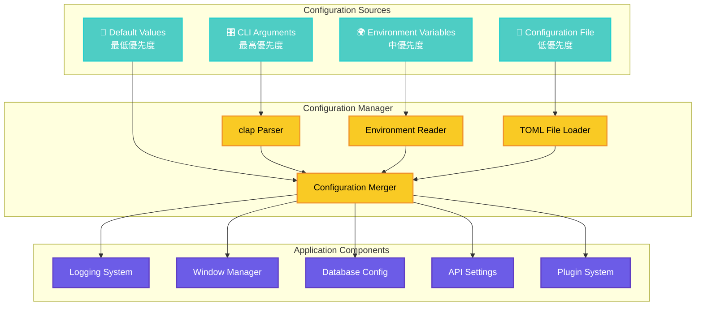

# liscov 設定管理システム詳細

## 📖 概要

liscovの設定管理システムは**多層設定アーキテクチャ**を採用し、柔軟性と使いやすさを両立しています。CLI引数、環境変数、設定ファイル、デフォルト値の4つの設定ソースを優先順位に従って統合します。

## 🏗️ 設定アーキテクチャ概要



## 🎛️ CLI引数システム詳細

### 引数定義構造

```rust
#[derive(Parser, Debug)]
#[command(name = "liscov")]
#[command(about = "YouTube Live Chat Monitor - ライブチャット監視ツール")]
#[command(version)]
struct Args {
    /// ログ出力ディレクトリを指定
    #[arg(long, value_name = "DIR")]
    log_dir: Option<PathBuf>,

    /// ログレベルを指定 (trace, debug, info, warn, error)
    #[arg(long, value_name = "LEVEL", default_value = "info")]
    log_level: String,

    /// ファイルログ出力を無効化
    #[arg(long)]
    no_file_logging: bool,

    /// 保存するログファイル数の上限
    #[arg(long, value_name = "NUM", default_value = "30")]
    max_log_files: u32,
}
```

### CLI引数のバリデーション

```rust
impl Args {
    /// CLI引数の妥当性を検証
    fn validate(&self) -> Result<(), ValidationError> {
        // ログレベルの検証
        match self.log_level.to_lowercase().as_str() {
            "trace" | "debug" | "info" | "warn" | "error" => {},
            _ => return Err(ValidationError::InvalidLogLevel(self.log_level.clone())),
        }
        
        // ログファイル数の検証
        if self.max_log_files == 0 || self.max_log_files > 1000 {
            return Err(ValidationError::InvalidLogFileCount(self.max_log_files));
        }
        
        // ログディレクトリの検証
        if let Some(ref dir) = self.log_dir {
            if !dir.exists() && std::fs::create_dir_all(dir).is_err() {
                return Err(ValidationError::InvalidLogDirectory(dir.clone()));
            }
        }
        
        Ok(())
    }
}
```

### ヘルプ表示例

```bash
$ liscov --help

liscov 0.1.0
YouTube Live Chat Monitor - ライブチャット監視ツール

USAGE:
    liscov [OPTIONS]

OPTIONS:
        --log-dir <DIR>              ログ出力ディレクトリを指定
        --log-level <LEVEL>          ログレベルを指定 [default: info]
        --max-log-files <NUM>        保存するログファイル数の上限 [default: 30]
        --no-file-logging            ファイルログ出力を無効化
    -h, --help                       Print help information
    -V, --version                    Print version information
```

## 🌍 環境変数システム

### サポートされる環境変数

| 環境変数名 | 説明 | 例 | デフォルト値 |
|------------|------|-----|-------------|
| `LISCOV_LOG_DIR` | ログディレクトリ | `/var/log/liscov` | XDGデフォルト |
| `LISCOV_LOG_LEVEL` | ログレベル | `debug` | `info` |
| `LISCOV_CONFIG_DIR` | 設定ディレクトリ | `/etc/liscov` | XDGデフォルト |
| `LISCOV_DATA_DIR` | データディレクトリ | `/var/lib/liscov` | XDGデフォルト |
| `LISCOV_NO_FILE_LOG` | ファイルログ無効化 | `1` | `0` |

### 環境変数の使用例

```bash
# ログレベルをデバッグに設定
export LISCOV_LOG_LEVEL=debug

# カスタムログディレクトリ
export LISCOV_LOG_DIR=/custom/log/path

# ファイルログを無効化
export LISCOV_NO_FILE_LOG=1

# アプリケーション起動
./liscov
```

### 環境変数の読み込み処理

```rust
fn load_environment_config() -> PartialConfig {
    let mut config = PartialConfig::default();
    
    // ログディレクトリ
    if let Ok(log_dir) = std::env::var("LISCOV_LOG_DIR") {
        config.log_dir = Some(PathBuf::from(log_dir));
    }
    
    // ログレベル
    if let Ok(log_level) = std::env::var("LISCOV_LOG_LEVEL") {
        config.log_level = Some(log_level);
    }
    
    // ファイルログ無効化
    if let Ok(no_file_log) = std::env::var("LISCOV_NO_FILE_LOG") {
        config.no_file_logging = no_file_log == "1" || no_file_log.to_lowercase() == "true";
    }
    
    config
}
```

## 📄 設定ファイルシステム

### 設定ファイル階層

```
~/.config/liscov/           # XDG Config Directory
├── config.toml             # メイン設定ファイル
├── window.toml             # ウィンドウ設定（自動生成）
├── plugins/                # プラグイン設定
│   ├── analytics.toml
│   └── filters.toml
└── debug.toml              # デバッグ設定（開発時）
```

### メイン設定ファイル (config.toml)

```toml
# liscov Configuration File
# Generated: 2025-06-25T00:25:08Z

[app]
version = "0.1.0"
auto_save_interval = 60  # seconds

[window]
width = 1200
height = 800
x = 100
y = 100
maximized = false
always_on_top = false
resizable = true

[log]
enable_file_logging = true
log_level = "info"
log_dir = "~/.local/share/liscov/logs"
max_log_files = 30
max_file_size = "10MB"
rotation_strategy = "size"

[database]
file_path = "~/.local/share/liscov/database.sqlite"
auto_vacuum = true
journal_mode = "WAL"
cache_size = 2000

[api]
request_timeout = 30
max_retries = 3
retry_delay = 2
user_agent = "liscov/0.1.0"

[ui]
theme = "light"
chat_message_limit = 1000
auto_scroll = true
show_timestamps = true
compact_mode = false

[export]
default_format = "csv"
default_directory = "~/Downloads"
include_metadata = true
```

### 設定ファイルの読み込み処理

```rust
use serde::{Deserialize, Serialize};
use std::path::PathBuf;

#[derive(Debug, Clone, Serialize, Deserialize)]
pub struct AppConfig {
    pub app: AppSettings,
    pub window: WindowConfig,
    pub log: LogConfig,
    pub database: DatabaseConfig,
    pub api: ApiConfig,
    pub ui: UiConfig,
    pub export: ExportConfig,
}

impl AppConfig {
    /// 設定ファイルから読み込み
    pub fn load_from_file<P: AsRef<Path>>(path: P) -> Result<Self, ConfigError> {
        let content = std::fs::read_to_string(path)?;
        let config: AppConfig = toml::from_str(&content)?;
        Ok(config)
    }
    
    /// 設定ファイルに保存
    pub fn save_to_file<P: AsRef<Path>>(&self, path: P) -> Result<(), ConfigError> {
        let content = toml::to_string_pretty(self)?;
        std::fs::write(path, content)?;
        Ok(())
    }
}
```

## 🔧 ConfigManager詳細

### ConfigManagerの構造

```rust
pub struct ConfigManager {
    config_dir: PathBuf,
    config_file: PathBuf,
    window_file: PathBuf,
}

impl ConfigManager {
    /// 新しいConfigManagerを作成
    pub fn new() -> LiscovResult<Self> {
        let config_dir = Self::get_config_directory()?;
        
        // 設定ディレクトリが存在しない場合は作成
        if !config_dir.exists() {
            std::fs::create_dir_all(&config_dir)?;
        }
        
        Ok(Self {
            config_file: config_dir.join("config.toml"),
            window_file: config_dir.join("window.toml"),
            config_dir,
        })
    }
    
    /// XDG準拠の設定ディレクトリを取得
    fn get_config_directory() -> LiscovResult<PathBuf> {
        use directories::ProjectDirs;
        
        let project_dirs = ProjectDirs::from("dev", "sifyfy", "liscov")
            .ok_or_else(|| GuiError::Configuration("Could not determine config directory".to_string()))?;
            
        Ok(project_dirs.config_dir().to_path_buf())
    }
}
```

### 設定の統合処理

```rust
impl ConfigManager {
    /// 全ての設定ソースを統合して最終設定を生成
    pub fn resolve_config(
        &self,
        cli_args: &Args,
        env_config: &PartialConfig,
    ) -> LiscovResult<AppConfig> {
        // 1. デフォルト設定から開始
        let mut config = AppConfig::default();
        
        // 2. 設定ファイルから読み込み（失敗時はデフォルト継続）
        if let Ok(file_config) = self.load_config() {
            config = self.merge_configs(config, file_config)?;
        }
        
        // 3. 環境変数をマージ
        config = self.apply_env_config(config, env_config)?;
        
        // 4. CLI引数をマージ（最高優先度）
        config = self.apply_cli_args(config, cli_args)?;
        
        // 5. 最終バリデーション
        self.validate_final_config(&config)?;
        
        Ok(config)
    }
    
    /// CLI引数を設定に適用
    fn apply_cli_args(&self, mut config: AppConfig, args: &Args) -> LiscovResult<AppConfig> {
        if let Some(ref log_dir) = args.log_dir {
            config.log.log_dir = Some(log_dir.clone());
        }
        
        if !args.log_level.is_empty() {
            config.log.log_level = args.log_level.clone();
        }
        
        if args.no_file_logging {
            config.log.enable_file_logging = false;
        }
        
        config.log.max_log_files = args.max_log_files;
        
        Ok(config)
    }
}
```

## 🔍 設定検証システム

### バリデーション規則

```rust
pub trait ConfigValidator {
    fn validate(&self) -> Result<(), Vec<ValidationError>>;
}

impl ConfigValidator for AppConfig {
    fn validate(&self) -> Result<(), Vec<ValidationError>> {
        let mut errors = Vec::new();
        
        // ウィンドウ設定の検証
        if let Err(e) = self.window.validate() {
            errors.extend(e);
        }
        
        // ログ設定の検証
        if let Err(e) = self.log.validate() {
            errors.extend(e);
        }
        
        // データベース設定の検証
        if let Err(e) = self.database.validate() {
            errors.extend(e);
        }
        
        if errors.is_empty() {
            Ok(())
        } else {
            Err(errors)
        }
    }
}

impl ConfigValidator for WindowConfig {
    fn validate(&self) -> Result<(), Vec<ValidationError>> {
        let mut errors = Vec::new();
        
        // サイズの検証
        if self.width < 640 || self.width > 7680 {
            errors.push(ValidationError::InvalidWindowWidth(self.width));
        }
        
        if self.height < 480 || self.height > 4320 {
            errors.push(ValidationError::InvalidWindowHeight(self.height));
        }
        
        // 位置の検証（スクリーン境界）
        if let Err(e) = validate_window_position(self.x, self.y, self.width, self.height) {
            errors.push(e);
        }
        
        if errors.is_empty() { Ok(()) } else { Err(errors) }
    }
}
```

### エラー回復戦略

```rust
#[derive(Debug, thiserror::Error)]
pub enum ConfigError {
    #[error("File I/O error: {0}")]
    Io(#[from] std::io::Error),
    
    #[error("TOML parse error: {0}")]
    TomlParse(#[from] toml::de::Error),
    
    #[error("Validation error: {errors:?}")]
    Validation { errors: Vec<ValidationError> },
    
    #[error("Directory creation failed: {path}")]
    DirectoryCreation { path: PathBuf },
}

impl ConfigManager {
    /// エラー時のフォールバック処理
    pub fn load_config_with_fallback(&self) -> AppConfig {
        match self.load_config() {
            Ok(config) => {
                tracing::info!("✅ Configuration loaded successfully");
                config
            },
            Err(ConfigError::Io(_)) => {
                tracing::warn!("📄 Config file not found, using defaults");
                AppConfig::default()
            },
            Err(ConfigError::TomlParse(e)) => {
                tracing::error!("❌ Config parse error: {}, using defaults", e);
                AppConfig::default()
            },
            Err(ConfigError::Validation { errors }) => {
                tracing::error!("❌ Config validation failed: {:?}, using defaults", errors);
                AppConfig::default()
            },
            Err(e) => {
                tracing::error!("❌ Unexpected config error: {}, using defaults", e);
                AppConfig::default()
            }
        }
    }
}
```

## 🔄 動的設定更新

### 実行時設定変更

```rust
impl ConfigManager {
    /// 実行時に設定を更新
    pub async fn update_config_runtime(&self, updates: ConfigUpdates) -> LiscovResult<()> {
        let mut current_config = self.load_config()?;
        
        // 設定を更新
        if let Some(log_level) = updates.log_level {
            current_config.log.log_level = log_level;
            // ログレベルを即座に適用
            self.apply_log_level_change(&current_config.log.log_level)?;
        }
        
        if let Some(ui_theme) = updates.ui_theme {
            current_config.ui.theme = ui_theme;
            // UIテーマを即座に適用
            self.apply_theme_change(&current_config.ui.theme).await?;
        }
        
        // 設定を保存
        self.save_config(&current_config)?;
        
        // 他のコンポーネントに通知
        self.notify_config_changed().await?;
        
        Ok(())
    }
}
```

### 設定変更の通知システム

```rust
pub struct ConfigChangeNotifier {
    subscribers: Vec<Box<dyn ConfigChangeListener>>,
}

pub trait ConfigChangeListener: Send + Sync {
    async fn on_config_changed(&self, changes: &ConfigChanges);
}

impl ConfigChangeNotifier {
    pub async fn notify_all(&self, changes: ConfigChanges) {
        for listener in &self.subscribers {
            listener.on_config_changed(&changes).await;
        }
    }
}
```

## 📊 設定使用統計

### 設定値のトラッキング

```rust
#[derive(Debug)]
pub struct ConfigUsageStats {
    pub cli_overrides: HashMap<String, u32>,
    pub env_overrides: HashMap<String, u32>,
    pub file_settings: HashMap<String, u32>,
    pub default_values: HashMap<String, u32>,
}

impl ConfigUsageStats {
    /// どの設定ソースが使用されているかの統計
    pub fn generate_report(&self) -> String {
        format!(
            "Configuration Usage Report:\n\
             CLI Overrides: {} settings\n\
             Environment Variables: {} settings\n\
             File Settings: {} settings\n\
             Default Values: {} settings",
            self.cli_overrides.len(),
            self.env_overrides.len(),
            self.file_settings.len(),
            self.default_values.len()
        )
    }
}
```

---

**最終更新**: 2025-06-25  
**対象バージョン**: 0.1.0  
**アーキテクチャレベル**: Configuration System  
**関連ファイル**: `src/bin/liscov.rs`, `src/gui/config_manager.rs`
