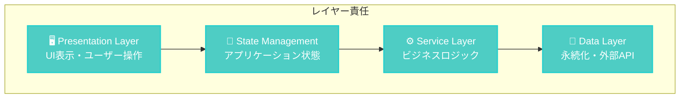

# liscov 設計原則とアーキテクチャパターン

## 🎯 設計哲学

liscovは以下の設計哲学に基づいて開発されています：

> **"Real-time, Resilient, Responsive"** - リアルタイム性、回復力、応答性を重視したアーキテクチャ

## 🏗️ 主要設計原則

### 1. 📡 イベント駆動アーキテクチャ (Event-Driven Architecture)

**原則**: すべての状態変更はイベントを通じて行い、コンポーネント間の疎結合を実現する

**実装**:

```rust
// 📍 src/gui/state_management.rs
#[derive(Debug, Clone)]
pub enum AppEvent {
    MessageAdded(GuiChatMessage),
    ConnectionChanged { is_connected: bool },
    ServiceStateChanged(ServiceState),
    // ... その他のイベント
}

pub struct StateManager {
    state: Arc<Mutex<AppState>>,
    event_sender: mpsc::UnboundedSender<AppEvent>,
    // ...
}
```

**利点**:

- 🔄 非同期処理の自然な統合
- 🧩 コンポーネント間の疎結合
- 🔍 デバッグとテストの容易さ
- 📈 スケーラビリティの向上

### 2. 🏗️ レイヤー分離 (Separation of Concerns)

**原則**: 各層は明確な責任を持ち、上位層は下位層にのみ依存する



**責任分担**:

- **Presentation**: UI描画、ユーザーインタラクション
- **State Management**: アプリケーション状態の一元管理
- **Service**: API呼び出し、データ変換、ビジネスロジック
- **Data**: データベース操作、ファイルI/O、外部API

### 3. 🧠 メモリ効率性 (Memory Efficiency)

**原則**: 大量のメッセージを扱うため、メモリ使用量を厳密に制御する

**実装戦略**:

```rust
// 📍 src/gui/memory_optimized.rs
pub struct OptimizedMessageManager {
    buffer: VecDeque<GuiChatMessage>,
    max_capacity: usize,  // デフォルト1000件
    total_processed: usize,
    dropped_count: usize,
}

impl OptimizedMessageManager {
    pub fn add_message(&mut self, message: GuiChatMessage) {
        if self.buffer.len() >= self.max_capacity {
            self.buffer.pop_front(); // 古いメッセージを削除
            self.dropped_count += 1;
        }
        self.buffer.push_back(message);
        self.total_processed += 1;
    }
}
```

**最適化手法**:

- 🔄 循環バッファによる固定メモリ使用
- 📦 バッチ処理によるアロケーション削減
- 🧹 定期的なメモリクリーンアップ

### 4. 🛡️ エラー回復性 (Error Recovery & Resilience)

**原則**: エラーが発生しても可能な限りアプリケーションを継続実行する

**階層化エラー処理**:

```rust
// 📍 src/lib.rs
#[derive(Error, Debug)]
pub enum LiscovError {
    #[error("API error: {0}")]
    Api(#[from] ApiError),
    #[error("Database error: {0}")]
    Database(#[from] DatabaseError),
    #[error("GUI error: {0}")]
    Gui(#[from] GuiError),
    // ... その他のエラー型
}
```

**回復戦略**:

- 🔄 自動再接続メカニズム
- 📄 エラーログとユーザー通知の分離
- 🛡️ フォールバック処理とデフォルト値
- 💾 状態の永続化とリストア

### 5. ⚙️ 設定駆動開発 (Configuration-Driven Development)

**原則**: ハードコーディングを避け、設定ファイルによる柔軟な制御を実現する

**設定階層**:

```rust
// 📍 src/gui/config_manager.rs
#[derive(Debug, Clone, Serialize, Deserialize)]
pub struct AppConfig {
    pub window: WindowConfig,
    pub log: LogConfig,
    pub api: ApiConfig,
    pub database: DatabaseConfig,
}
```

**設定優先順位**:

1. 🎛️ CLI引数 (最高優先度)
2. 🌍 環境変数
3. 📄 設定ファイル
4. 🔧 デフォルト値 (最低優先度)

## 📐 アーキテクチャパターン

### 1. 🏭 Factory Pattern (プラグインシステム)

**目的**: プラグインの動的生成とライフサイクル管理

```rust
// 📍 src/gui/plugin_system.rs
pub trait Plugin: Send + Sync {
    fn name(&self) -> &str;
    fn initialize(&mut self) -> Result<(), Box<dyn std::error::Error>>;
    fn process_message(&mut self, message: &GuiChatMessage) -> Option<PluginResult>;
}

pub struct PluginManager {
    plugins: Vec<Box<dyn Plugin>>,
}
```

### 2. 🔍 Observer Pattern (状態変更通知)

**目的**: 状態変更の効率的な通知とUI更新

```rust
// 📍 Dioxus Signalsとの統合
fn use_chat_state() -> (Signal<AppState>, impl Fn(AppEvent)) {
    let state = use_signal(|| AppState::default());
    let state_manager = get_state_manager();
    
    // イベント送信関数を返す
    let send_event = move |event: AppEvent| {
        let _ = state_manager.send_event(event);
    };
    
    (state, send_event)
}
```

### 3. 📝 Command Pattern (操作の抽象化)

**目的**: UI操作とビジネスロジックの分離

```rust
// 📍 src/gui/commands/mod.rs
pub trait Command {
    type Result;
    async fn execute(&self) -> LiscovResult<Self::Result>;
}

pub struct ConnectToStreamCommand {
    pub url: String,
}

impl Command for ConnectToStreamCommand {
    type Result = ();
    
    async fn execute(&self) -> LiscovResult<Self::Result> {
        // 接続処理の実装
    }
}
```

### 4. 🔧 Strategy Pattern (アナリティクス処理)

**目的**: 異なる分析アルゴリズムの交換可能な実装

```rust
// 📍 src/analytics/mod.rs
pub trait AnalyticsStrategy {
    fn analyze(&self, messages: &[GuiChatMessage]) -> AnalyticsResult;
}

pub struct RevenueAnalyzer;
pub struct EngagementAnalyzer;
pub struct TrendAnalyzer;

impl AnalyticsStrategy for RevenueAnalyzer {
    fn analyze(&self, messages: &[GuiChatMessage]) -> AnalyticsResult {
        // 収益分析の実装
    }
}
```

### 5. 🏗️ Builder Pattern (設定オブジェクト構築)

**目的**: 複雑な設定オブジェクトの段階的構築

```rust
// 📍 src/io/raw_response_saver.rs
pub struct SaveConfigBuilder {
    enabled: bool,
    file_path: String,
    max_file_size: Option<u64>,
    rotation_strategy: Option<RotationStrategy>,
}

impl SaveConfigBuilder {
    pub fn enabled(mut self, enabled: bool) -> Self {
        self.enabled = enabled;
        self
    }
    
    pub fn build(self) -> SaveConfig {
        SaveConfig {
            enabled: self.enabled,
            file_path: self.file_path,
            // ...
        }
    }
}
```

## 🔄 非同期処理パターン

### 1. 📡 Channel-based Communication

**パターン**: コンポーネント間の非同期メッセージ交換

```rust
// 状態管理での使用例
let (event_sender, event_receiver) = mpsc::unbounded_channel();

// イベント処理ループ
tokio::spawn(async move {
    while let Some(event) = event_receiver.recv().await {
        handle_event(event);
    }
});
```

### 2. 🔄 Periodic Tasks with Graceful Shutdown

**パターン**: 定期実行タスクの適切な停止制御

```rust
// 📍 ウィンドウ状態の定期保存
use_effect({
    let window = window.clone();
    move || {
        spawn(async move {
            let mut interval = tokio::time::interval(Duration::from_secs(1));
            loop {
                interval.tick().await;
                save_window_state(&window);
            }
        });
    }
});
```

### 3. 🛡️ Error Boundary Pattern

**パターン**: エラーの局所化と回復処理

```rust
async fn robust_api_call() -> LiscovResult<Response> {
    for attempt in 1..=3 {
        match make_api_call().await {
            Ok(response) => return Ok(response),
            Err(e) if attempt < 3 => {
                tracing::warn!("API call failed (attempt {}): {}", attempt, e);
                tokio::time::sleep(Duration::from_secs(2_u64.pow(attempt))).await;
            }
            Err(e) => return Err(e),
        }
    }
    unreachable!()
}
```

## 📊 メモリ管理パターン

### 1. 🔄 Circular Buffer with Statistics

**目的**: 固定メモリでの大量データ処理

```rust
pub struct MemoryStats {
    pub used_memory: usize,
    pub capacity: usize,
    pub utilization: f64,
}

impl OptimizedMessageManager {
    pub fn memory_stats(&self) -> MemoryStats {
        let used = self.buffer.len() * std::mem::size_of::<GuiChatMessage>();
        let capacity = self.max_capacity * std::mem::size_of::<GuiChatMessage>();
        
        MemoryStats {
            used_memory: used,
            capacity,
            utilization: used as f64 / capacity as f64,
        }
    }
}
```

### 2. 🧹 Lazy Cleanup

**目的**: パフォーマンスを維持しながらのリソース解放

```rust
impl OptimizedMessageManager {
    pub fn optimize_memory(&mut self) {
        // 必要に応じてバッファサイズを縮小
        if self.buffer.capacity() > self.max_capacity * 2 {
            self.buffer.shrink_to_fit();
        }
    }
}
```

## 🎨 UI/UXパターン

### 1. 📱 Progressive Disclosure

**原則**: 情報の段階的開示によるUI複雑性の管理

- タブナビゲーションによる機能分離
- 折りたたみ可能なパネル設計
- 詳細表示のオンデマンド読み込み

### 2. 🔄 Optimistic Updates

**原則**: ユーザー操作に対する即座のフィードバック

```rust
// ユーザー操作に即座に応答
fn handle_connect_click() {
    // UI状態を即座に更新
    set_connection_status(ConnectionStatus::Connecting);
    
    // バックグラウンドで実際の処理
    spawn(async move {
        match connect_to_stream().await {
            Ok(_) => set_connection_status(ConnectionStatus::Connected),
            Err(e) => {
                set_connection_status(ConnectionStatus::Disconnected);
                show_error_message(e);
            }
        }
    });
}
```

### 3. 📊 Data-Driven UI

**原則**: 状態に基づく宣言的UI構築

```rust
rsx! {
    div {
        class: "chat-display",
        
        // 状態に基づく条件分岐
        if connection_state() == ConnectionState::Connected {
            ChatMessageList { messages: chat_messages() }
        } else {
            ConnectionPrompt { on_connect: handle_connect }
        }
        
        // 状態に基づくスタイリング
        StatusIndicator { 
            status: connection_state(),
            class: if is_error() { "error" } else { "normal" }
        }
    }
}
```

## 🔐 セキュリティパターン

### 1. 🛡️ Input Validation

**原則**: すべての外部入力の検証

```rust
pub fn validate_youtube_url(url: &str) -> Result<VideoId, ValidationError> {
    let url_regex = Regex::new(r"^https://(?:www\.)?youtube\.com/watch\?v=([a-zA-Z0-9_-]{11})$")?;
    
    match url_regex.captures(url) {
        Some(captures) => Ok(VideoId(captures[1].to_string())),
        None => Err(ValidationError::InvalidUrl),
    }
}
```

### 2. 🔒 Secure Configuration

**原則**: 機密情報の安全な管理

```rust
// 設定ファイルから機密情報を除外
#[derive(Serialize, Deserialize)]
pub struct PublicConfig {
    #[serde(skip_serializing)]
    pub api_key: Option<String>, // 設定ファイルに保存しない
    pub window: WindowConfig,
    pub log: LogConfig,
}
```

## 📈 パフォーマンスパターン

### 1. ⚡ Batch Processing

**目的**: 大量データの効率的処理

```rust
impl OptimizedMessageManager {
    pub fn add_messages_batch(&mut self, messages: Vec<GuiChatMessage>) {
        // バッチサイズに応じた最適化
        if messages.len() > self.max_capacity {
            // 最新のメッセージのみ保持
            let start = messages.len() - self.max_capacity;
            self.buffer = messages[start..].iter().cloned().collect();
        } else {
            // 既存バッファと結合
            self.buffer.extend(messages);
            while self.buffer.len() > self.max_capacity {
                self.buffer.pop_front();
                self.dropped_count += 1;
            }
        }
    }
}
```

### 2. 🔄 Reactive Caching

**目的**: 計算結果の効率的キャッシュ

```rust
use dioxus::prelude::*;

fn expensive_computation(data: &[GuiChatMessage]) -> ComputationResult {
    // 重い処理...
}

#[component]
fn AnalyticsPanel() -> Element {
    let messages = use_chat_messages();
    
    // メッセージが変更された時のみ再計算
    let analytics_result = use_memo(move || {
        expensive_computation(&messages.read())
    });
    
    rsx! {
        div { "Result: {analytics_result}" }
    }
}
```

## 🧪 テストパターン

### 1. 🎯 Test Doubles

**目的**: 外部依存性の分離

```rust
#[cfg(test)]
mod tests {
    use mockall::mock;
    
    mock! {
        ApiClient {}
        
        #[async_trait]
        impl ApiClient for ApiClient {
            async fn fetch_messages(&self, token: &str) -> Result<Vec<Message>, ApiError>;
        }
    }
    
    #[tokio::test]
    async fn test_service_with_mock() {
        let mut mock_client = MockApiClient::new();
        mock_client
            .expect_fetch_messages()
            .returning(|_| Ok(vec![]));
            
        let service = LiveChatService::new(Box::new(mock_client));
        // テスト実行...
    }
}
```

### 2. 🏗️ Builder Pattern for Test Data

**目的**: テストデータの構築簡素化

```rust
#[cfg(test)]
pub struct GuiChatMessageBuilder {
    message: GuiChatMessage,
}

impl GuiChatMessageBuilder {
    pub fn new() -> Self {
        Self {
            message: GuiChatMessage::default(),
        }
    }
    
    pub fn author(mut self, author: &str) -> Self {
        self.message.author = author.to_string();
        self
    }
    
    pub fn content(mut self, content: &str) -> Self {
        self.message.content = content.to_string();
        self
    }
    
    pub fn build(self) -> GuiChatMessage {
        self.message
    }
}

// 使用例
let test_message = GuiChatMessageBuilder::new()
    .author("TestUser")
    .content("Test message content")
    .build();
```

---

**最終更新**: 2025-06-25  
**対象バージョン**: 0.1.0  
**文書レベル**: Design Principles & Patterns
