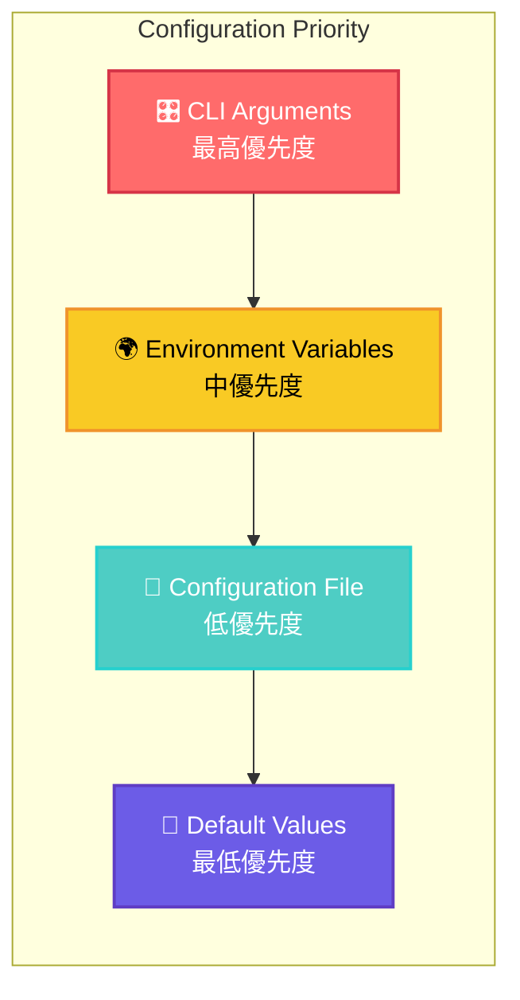
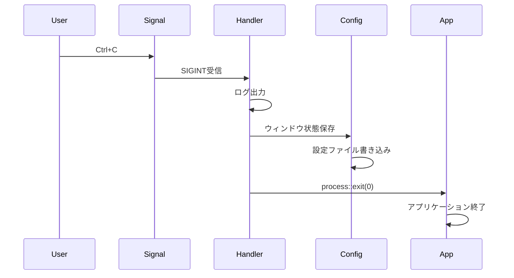

# liscov.rs エントリポイント詳細解析

## 📖 概要

`src/bin/liscov.rs` は liscov アプリケーションのメインエントリポイントです。227行のコードで以下の責任を持ちます：

1. **🎛️ CLI引数解析とバリデーション**
2. **⚙️ 設定管理システムの初期化**
3. **📊 ログシステムの構築**
4. **🪟 Dioxusウィンドウの設定と起動**
5. **🔄 状態管理とイベントループの開始**
6. **🛡️ シグナルハンドリングと適切な終了処理**

## 🏗️ アーキテクチャ構造

```mermaid
graph TD
    subgraph "Entry Point Structure"
        CLI[🎛️ CLI Arguments<br/>Args struct]
        Config[⚙️ Configuration<br/>ConfigManager]
        Logging[📊 Logging System<br/>tracing]
        Window[🪟 Window Setup<br/>Dioxus Config]
        Signal[🛡️ Signal Handler<br/>ctrlc]
        App[🚀 Dioxus App<br/>app() function]
    end
    
    CLI --> Config
    Config --> Logging
    Logging --> Window
    Window --> Signal
    Signal --> App
    
    classDef component fill:#4ecdc4,stroke:#26d0ce,stroke-width:2px,color:#fff
    class CLI,Config,Logging,Window,Signal,App component
```

## 🎛️ CLI引数システム

### CLI引数定義

```rust
/// CLI引数の定義
#[derive(Parser, Debug)]
#[command(name = "liscov")]
#[command(about = "YouTube Live Chat Monitor - ライブチャット監視ツール")]
#[command(version)]
struct Args {
    /// ログ出力ディレクトリを指定
    #[arg(long, value_name = "DIR")]
    log_dir: Option<PathBuf>,

    /// ログレベルを指定 (trace, debug, info, warn, error)
    #[arg(long, value_name = "LEVEL", default_value = "info")]
    log_level: String,

    /// ファイルログ出力を無効化
    #[arg(long)]
    no_file_logging: bool,

    /// 保存するログファイル数の上限
    #[arg(long, value_name = "NUM", default_value = "30")]
    max_log_files: u32,
}
```

### CLI使用例

```bash
# 基本起動
./liscov

# ログレベル指定
./liscov --log-level debug

# カスタムログディレクトリ
./liscov --log-dir /path/to/logs

# ファイルログ無効化
./liscov --no-file-logging

# すべてのオプション指定
./liscov --log-level trace --log-dir ./logs --max-log-files 50
```

### 設定優先順位



## ⚙️ 設定管理システム

### 設定読み込みフロー

```rust
// 既存の設定管理システムを使用してログ設定を取得
let config_manager = config_manager::ConfigManager::new()?;
let mut config = config_manager.load_config().unwrap_or_else(|e| {
    tracing::warn!("設定読み込みエラー、デフォルト設定を使用: {}", e);
    config_manager::AppConfig::default()
});

// CLI引数でログ設定を上書き
if args.no_file_logging {
    config.log.enable_file_logging = false;
}
if !args.log_level.is_empty() {
    config.log.log_level = args.log_level;
}
config.log.max_log_files = args.max_log_files;
```

### エラー回復戦略

liscovは設定読み込み失敗に対して堅牢な回復戦略を実装：

1. **📄 設定ファイル読み込み失敗**: デフォルト設定で継続
2. **🌍 環境変数の問題**: 設定ファイルまたはデフォルト値にフォールバック
3. **🎛️ CLI引数検証エラー**: 該当オプションのみスキップ

## 📊 ログシステム初期化

### ログ設定の決定ロジック

```rust
// ログディレクトリ決定（優先度: CLI > 環境変数 > 設定ファイル > XDGデフォルト）
let custom_log_dir = args.log_dir.or(env_log_dir);

// 強化されたログ初期化
#[cfg(not(feature = "debug-tokio"))]
utils::init_logging_with_config(&config.log, custom_log_dir.clone())?;
```

### ログ出力例

```
2025-06-25T00:25:08Z INFO  [liscov] 🎬 Starting liscov GUI - YouTube Live Chat Monitor
2025-06-25T00:25:08Z DEBUG [liscov] 📱 Starting Dioxus desktop application...
2025-06-25T00:25:08Z INFO  [liscov] 📁 ログ設定: ディレクトリ=Some("./logs"), レベル=info, 最大ファイル数=30
2025-06-25T00:25:08Z INFO  [liscov] 🔌 Plugin system initialized
2025-06-25T00:25:08Z INFO  [liscov] 🪟 ウィンドウ設定: 1200x800 at (100, 100), 最大化: false
```

### デバッグ機能統合

```rust
// tokio-consoleの初期化（プロファイリング用）
#[cfg(feature = "debug-tokio")]
console_subscriber::init();
```

## 🪟 Dioxusウィンドウ設定

### ウィンドウ設定の適用

```rust
// Dioxus 0.6.3のLaunchBuilderを使用してウィンドウ設定を適用
let mut launch_builder = dioxus::LaunchBuilder::desktop();

// ウィンドウ設定を適用
launch_builder = launch_builder.with_cfg(
    dioxus::desktop::Config::new().with_window(
        dioxus::desktop::tao::window::WindowBuilder::new()
            .with_title("liscov - YouTube Live Chat Monitor")
            .with_inner_size(dioxus::desktop::tao::dpi::LogicalSize::new(
                config.window.width as f64,
                config.window.height as f64,
            ))
            .with_position(dioxus::desktop::tao::dpi::LogicalPosition::new(
                config.window.x as f64,
                config.window.y as f64,
            ))
            .with_maximized(config.window.maximized)
            .with_resizable(true),
    ),
);
```

### ウィンドウ境界検証

```rust
// ウィンドウ位置をデスクトップ範囲内に調整
utils::validate_window_bounds(&mut config.window);
```

この処理により、以下を保証します：

- 🖥️ ウィンドウがスクリーン外に表示されることを防止
- 📐 最小/最大サイズの制約遵守
- 🔄 マルチモニター環境での適切な配置

## 🛡️ シグナルハンドリング

### 終了シグナルの処理

```rust
// Ctrl+Cシグナルハンドラー
ctrlc::set_handler(move || {
    tracing::info!("🛑 終了シグナルを受信しました");
    save_window_config_on_exit();
    std::process::exit(0);
})
.map_err(|e| liscov::GuiError::Configuration(format!("Failed to set signal handler: {}", e)))?;
```

### グレースフル終了



## 🔄 状態管理統合

### ウィンドウ状態の監視

```rust
// ウィンドウ状態を定期的に更新（軽量な監視）
use_effect({
    let window = window.clone();
    move || {
        let window = window.clone();
        spawn(async move {
            let mut interval = tokio::time::interval(tokio::time::Duration::from_secs(1));
            loop {
                interval.tick().await;

                // ウィンドウの現在状態を取得
                let current_size = window.inner_size();
                let current_position = window.outer_position().unwrap_or_default();
                let is_maximized = window.is_maximized();

                let window_config = config_manager::WindowConfig {
                    width: current_size.width,
                    height: current_size.height,
                    x: current_position.x,
                    y: current_position.y,
                    maximized: is_maximized,
                };

                // 最新の状態をグローバルに保存
                if let Ok(mut last_config) = LAST_WINDOW_CONFIG.lock() {
                    *last_config = Some(window_config);
                }
            }
        });
    }
});
```

### グローバル状態管理

```rust
/// ウィンドウ設定の保存用
static LAST_WINDOW_CONFIG: Mutex<Option<config_manager::WindowConfig>> = Mutex::new(None);
```

このグローバル静的変数により：

- 🔄 1秒間隔でのリアルタイム状態追跡
- 💾 アプリケーション終了時の自動保存
- 🛡️ マルチスレッド環境での安全な状態アクセス

## 🚀 Dioxusアプリケーション起動

### アプリケーション関数

```rust
/// Dioxus 0.6.3ベースのliscov GUI アプリケーション
/// Slintから移行 (Phase 0-1: 技術検証・基本構造)
fn app() -> Element {
    let window = dioxus::desktop::use_window();

    // ウィンドウ状態監視の開始
    // ...

    rsx! {
        div {
            class: "app",
            style: "
                height: 100vh;
                margin: 0;
                padding: 0;
                overflow: hidden;
                background: #f0f2f5;
                font-family: 'Segoe UI', Tahoma, Geneva, Verdana, sans-serif;
            ",

            MainWindow {}
        }
    }
}
```

### 最終起動

```rust
// Dioxusアプリケーションを起動
launch_builder.launch(app);

// 正常終了時の設定保存
save_window_config_on_exit();

tracing::info!("👋 liscov GUI shutting down");
Ok(())
```

## 💾 設定永続化システム

### 終了時設定保存

```rust
/// 終了時にウィンドウ設定を保存
fn save_window_config_on_exit() {
    if let Ok(last_config_guard) = LAST_WINDOW_CONFIG.lock() {
        if let Some(window_config) = last_config_guard.as_ref() {
            // 新しいConfigManagerインスタンスを作成
            if let Ok(config_manager) = config_manager::ConfigManager::new() {
                // 既存の設定を読み込み、ウィンドウ設定のみ更新
                if let Ok(mut config) = config_manager.load_config() {
                    config.window = window_config.clone();

                    if let Err(e) = config_manager.save_config(&config) {
                        tracing::error!("設定保存エラー: {}", e);
                    } else {
                        tracing::info!(
                            "💾 ウィンドウ設定を保存しました: {}x{} at ({}, {}), 最大化: {}",
                            config.window.width,
                            config.window.height,
                            config.window.x,
                            config.window.y,
                            config.window.maximized
                        );
                    }
                } else {
                    tracing::warn!("既存設定の読み込みに失敗しました");
                }
            } else {
                tracing::error!("ConfigManagerの作成に失敗しました");
            }
        } else {
            tracing::warn!("保存する最新のウィンドウ設定が見つかりませんでした");
        }
    }
}
```

## 🔧 プラグインシステム初期化

```rust
// プラグインシステムを初期化
let _plugin_manager = Arc<PluginManager::new()>;
tracing::info!("🔌 Plugin system initialized");
```

プラグインシステムは将来の拡張性を考慮した設計で、現在は基本的な初期化のみ実装されています。

## 📊 パフォーマンス考慮事項

### メモリ効率性

- 🔄 **軽量監視**: 1秒間隔の状態監視は最小限のCPU使用
- 📦 **最小アロケーション**: 設定オブジェクトの再利用
- 🧹 **適切なクリーンアップ**: 終了時のリソース解放

### 応答性

- ⚡ **非ブロッキング初期化**: 設定読み込み失敗でも継続
- 🔄 **バックグラウンド処理**: ウィンドウ状態監視の非同期実行
- 🛡️ **エラー分離**: 部分的な失敗がアプリ全体に影響しない

### 起動時間最適化

- 📄 **遅延初期化**: 必要な時点でのプラグイン読み込み
- ⚙️ **並列処理**: 独立したシステムの同時初期化
- 🎯 **最小限のI/O**: 設定ファイルの効率的読み込み

---

**最終更新**: 2025-06-25  
**対象バージョン**: 0.1.0  
**解析対象**: src/bin/liscov.rs (227 lines)  
**アーキテクチャレベル**: Entry Point Analysis
