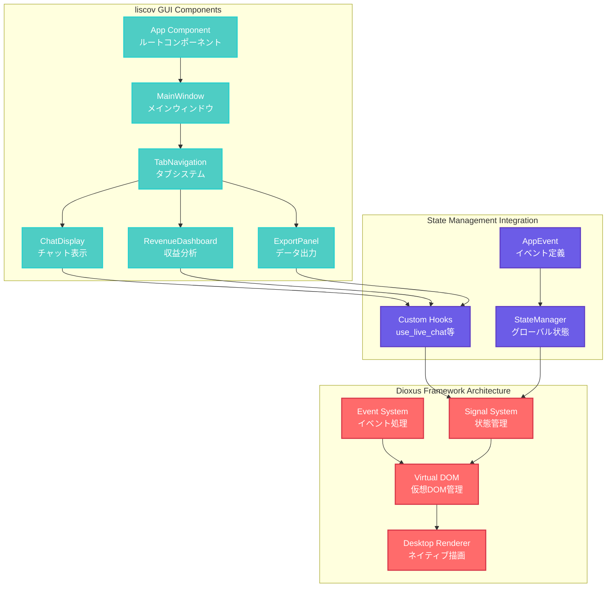

# liscov GUI層アーキテクチャ詳細

## 📖 概要

liscovのGUI層は**Dioxus 0.6.3**を基盤とした現代的なリアクティブアーキテクチャを採用しています。Slintからの移行によって、より柔軟で保守性の高いUIシステムを実現し、Phase 0-1の技術検証を経て基本構造が確立されています。

## 🏗️ Dioxus 0.6.3 アーキテクチャ概要



## 🧩 コンポーネント階層構造

### ルートコンポーネント設計

```rust
/// Dioxus 0.6.3ベースのliscov GUI アプリケーション
/// Slintから移行 (Phase 0-1: 技術検証・基本構造)
#[component]
fn App() -> Element {
    let window = dioxus::desktop::use_window();

    // ウィンドウ状態監視の開始
    use_effect({
        let window = window.clone();
        move || {
            spawn(async move {
                start_window_monitoring(window).await;
            });
        }
    });

    rsx! {
        div {
            class: "app",
            style: "
                height: 100vh;
                margin: 0;
                padding: 0;
                overflow: hidden;
                background: #f0f2f5;
                font-family: 'Segoe UI', Tahoma, Geneva, Verdana, sans-serif;
            ",

            MainWindow {}
        }
    }
}
```

### コンポーネント責任分担

| コンポーネント | 責任 | データソース | レンダリング頻度 |
|---------------|------|-------------|-----------------|
| `App` | アプリケーション初期化・ウィンドウ管理 | システム設定 | 1回 |
| `MainWindow` | レイアウト管理・ヘッダー表示 | 接続状態・メニュー | 低頻度 |
| `TabNavigation` | タブ切り替え・ナビゲーション | アクティブタブ | 中頻度 |
| `ChatDisplay` | ライブチャット表示 | メッセージ配列 | 高頻度 |
| `RevenueDashboard` | 収益分析・グラフ表示 | 収益データ | 中頻度 |
| `ExportPanel` | データエクスポート機能 | エクスポート設定 | 低頻度 |
| `FilterPanel` | メッセージフィルタリング | フィルタ条件 | 中頻度 |
| `StatusPanel` | 接続状況・統計表示 | 接続統計 | 中頻度 |

## 🔄 Dioxus Signal System

### Signal-based状態管理

```rust
use dioxus::prelude::*;

/// アプリケーション全体の状態を管理するSignal
#[derive(Clone, PartialEq)]
pub struct AppSignalState {
    pub messages: Vec<GuiChatMessage>,
    pub connection_status: ConnectionStatus,
    pub current_url: Option<String>,
    pub is_loading: bool,
    pub error_message: Option<String>,
}

impl Default for AppSignalState {
    fn default() -> Self {
        Self {
            messages: Vec::new(),
            connection_status: ConnectionStatus::Disconnected,
            current_url: None,
            is_loading: false,
            error_message: None,
        }
    }
}

/// グローバルSignalの定義
static APP_STATE: GlobalSignal<AppSignalState> = Signal::global(|| AppSignalState::default());

/// カスタムフック：アプリケーション状態にアクセス
pub fn use_app_state() -> Signal<AppSignalState> {
    APP_STATE()
}

/// カスタムフック：メッセージ一覧にアクセス
pub fn use_chat_messages() -> ReadOnlySignal<Vec<GuiChatMessage>> {
    let app_state = use_app_state();
    use_memo(move || app_state.read().messages.clone())
}

/// カスタムフック：接続状態にアクセス
pub fn use_connection_status() -> ReadOnlySignal<ConnectionStatus> {
    let app_state = use_app_state();
    use_memo(move || app_state.read().connection_status)
}
```

### StateManagerとSignalの統合

```rust
/// StateManagerイベントをDioxus Signalに変換
pub fn use_state_manager_integration() {
    let app_state = use_app_state();
    let state_manager = get_state_manager();

    use_effect({
        let app_state = app_state.clone();
        move || {
            spawn(async move {
                // StateManagerからの状態変更を監視
                let mut state_updates = state_manager.subscribe_to_updates();
                
                while let Some(update) = state_updates.recv().await {
                    match update {
                        StateUpdate::MessagesChanged(messages) => {
                            app_state.write().messages = messages;
                        },
                        StateUpdate::ConnectionChanged(status) => {
                            app_state.write().connection_status = status;
                        },
                        StateUpdate::ErrorOccurred(error) => {
                            app_state.write().error_message = Some(error);
                        },
                    }
                }
            });
        }
    });
}
```

### SignalManagerの非同期実行戦略

- `src/gui/signal_manager.rs` の `SignalTaskExecutor` で Dioxus の `spawn` と Tokio の `tokio::spawn` を切り替えられる抽象層を設けたのだ。
- 実行器は `SignalManager::new_with_executor` で注入可能になり、プロダクションは `SignalManager::new()` 経由で Dioxus 実行器を利用しつつ、テストでは `SignalTaskExecutor::tokio()` を渡して純粋な Tokio ランタイム上で検証できるのだ。
- バッチ処理ループはこれまでどおり 16ms 間隔の `tokio::time::interval` を使用するが、実行器を差し替えることで GUI 以外の統合テストや将来のバックエンド連携にも再利用しやすくなったのだ。

## 🎨 レンダリング最適化

### 計算量制限とメモ化

```rust
/// 大量メッセージの効率的レンダリング
#[component]
pub fn ChatMessageList() -> Element {
    let messages = use_chat_messages();
    let visible_count = use_signal(|| 50); // 表示件数制限
    
    // 表示対象メッセージの計算（メモ化）
    let visible_messages = use_memo(move || {
        let msgs = messages.read();
        let total = msgs.len();
        let start = if total > visible_count() {
            total - visible_count()
        } else {
            0
        };
        msgs[start..].to_vec()
    });
    
    // 仮想スクロール対応
    let scroll_position = use_signal(|| 0.0);
    let container_height = use_signal(|| 600.0);
    let item_height = 40.0; // 1メッセージの高さ
    
    let visible_start = use_memo(move || {
        (scroll_position() / item_height) as usize
    });
    
    let visible_end = use_memo(move || {
        let start = visible_start();
        let count = (container_height() / item_height) as usize + 2; // バッファ
        std::cmp::min(start + count, visible_messages.read().len())
    });

    rsx! {
        div {
            class: "chat-message-list",
            style: "height: {container_height()}px; overflow-y: auto;",
            onscroll: move |event| {
                scroll_position.set(event.data.scroll_top());
            },
            
            // 仮想スクロール実装
            div {
                style: "height: {visible_messages.read().len() as f64 * item_height}px; position: relative;",
                
                for (i, message) in visible_messages.read()[visible_start()..visible_end()].iter().enumerate() {
                    div {
                        key: "{message.timestamp}-{i}",
                        style: "
                            position: absolute;
                            top: {(visible_start() + i) as f64 * item_height}px;
                            width: 100%;
                            height: {item_height}px;
                        ",
                        ChatMessageItem { message: message.clone() }
                    }
                }
            }
        }
    }
}
```

### レンダリング負荷分散

```rust
/// 重い処理の非同期化
#[component]
pub fn RevenueDashboard() -> Element {
    let revenue_data = use_signal(|| None::<RevenueData>);
    let is_calculating = use_signal(|| false);
    
    // 重い計算を背景で実行
    let calculate_revenue = use_callback({
        let revenue_data = revenue_data.clone();
        let is_calculating = is_calculating.clone();
        
        move |_| {
            spawn(async move {
                is_calculating.set(true);
                
                // 重い収益計算を非同期で実行
                let result = tokio::task::spawn_blocking(|| {
                    calculate_revenue_analytics()
                }).await;
                
                match result {
                    Ok(data) => revenue_data.set(Some(data)),
                    Err(e) => tracing::error!("Revenue calculation failed: {}", e),
                }
                
                is_calculating.set(false);
            });
        }
    });

    // データ変更時に自動再計算
    use_effect({
        let calculate_revenue = calculate_revenue.clone();
        move || {
            let messages = use_chat_messages();
            
            // メッセージ配列が変更された時のみ再計算
            if messages.read().len() % 100 == 0 { // 100件ごとに更新
                calculate_revenue.call(());
            }
        }
    });

    rsx! {
        div { class: "revenue-dashboard",
            if is_calculating() {
                div { class: "loading-spinner",
                    "📊 収益データを計算中..."
                }
            } else if let Some(data) = revenue_data() {
                RevenueCharts { data }
            } else {
                div { class: "no-data",
                    "💰 収益データがありません"
                }
            }
        }
    }
}
```

## 🔧 イベントハンドリング

### ユーザーインタラクション処理

```rust
/// 統一されたイベントハンドリングパターン
#[component]
pub fn InputSection() -> Element {
    let url_input = use_signal(|| String::new());
    let connection_status = use_connection_status();
    let state_manager = get_state_manager();

    // 接続処理
    let handle_connect = use_callback({
        let url_input = url_input.clone();
        let state_manager = state_manager.clone();
        
        move |_| {
            let url = url_input.read().clone();
            let state_manager = state_manager.clone();
            
            spawn(async move {
                // 入力検証
                if let Err(e) = validate_youtube_url(&url) {
                    state_manager.send_event(AppEvent::ErrorOccurred(e.to_string())).ok();
                    return;
                }
                
                // 接続状態を即座に更新（楽観的更新）
                state_manager.send_event(AppEvent::ConnectionChanged { 
                    is_connected: true 
                }).ok();
                
                // 実際の接続処理
                match connect_to_youtube_stream(&url).await {
                    Ok(()) => {
                        state_manager.send_event(AppEvent::CurrentUrlUpdated(Some(url))).ok();
                    },
                    Err(e) => {
                        state_manager.send_event(AppEvent::ConnectionChanged { 
                            is_connected: false 
                        }).ok();
                        state_manager.send_event(AppEvent::ErrorOccurred(e.to_string())).ok();
                    }
                }
            });
        }
    });

    // 切断処理
    let handle_disconnect = use_callback({
        let state_manager = state_manager.clone();
        
        move |_| {
            spawn(async move {
                state_manager.send_event(AppEvent::ConnectionChanged { 
                    is_connected: false 
                }).ok();
                state_manager.send_event(AppEvent::CurrentUrlUpdated(None)).ok();
            });
        }
    });

    rsx! {
        div { class: "input-section",
            div { class: "url-input-group",
                input {
                    r#type: "text",
                    placeholder: "YouTubeライブ配信のURLを入力...",
                    value: "{url_input}",
                    oninput: move |event| url_input.set(event.value()),
                    onkeydown: move |event| {
                        if event.key() == Key::Enter {
                            handle_connect.call(());
                        }
                    }
                }
                
                match connection_status() {
                    ConnectionStatus::Disconnected => rsx! {
                        button {
                            class: "connect-button",
                            onclick: handle_connect,
                            disabled: url_input.read().is_empty(),
                            "🔗 接続"
                        }
                    },
                    ConnectionStatus::Connecting => rsx! {
                        button {
                            class: "connecting-button",
                            disabled: true,
                            "⏳ 接続中..."
                        }
                    },
                    ConnectionStatus::Connected => rsx! {
                        button {
                            class: "disconnect-button",
                            onclick: handle_disconnect,
                            "🔌 切断"
                        }
                    },
                }
            }
        }
    }
}
```

### エラーバウンダリーとフォールバック

```rust
/// エラー境界コンポーネント
#[component]
pub fn ErrorBoundary(children: Element, fallback: Option<Element>) -> Element {
    let error = use_signal(|| None::<String>);
    let has_error = use_memo(move || error.read().is_some());

    // グローバルエラーの監視
    use_effect({
        let error = error.clone();
        move || {
            let state_manager = get_state_manager();
            spawn(async move {
                let mut error_stream = state_manager.subscribe_to_errors();
                while let Some(err) = error_stream.recv().await {
                    error.set(Some(err));
                }
            });
        }
    });

    if has_error() {
        if let Some(fallback_ui) = fallback {
            return fallback_ui;
        }
        
        rsx! {
            div { class: "error-boundary",
                h3 { "⚠️ エラーが発生しました" }
                p { "{error.read().as_ref().unwrap_or(&\"Unknown error\".to_string())}" }
                button {
                    onclick: move |_| error.set(None),
                    "🔄 再試行"
                }
            }
        }
    } else {
        children
    }
}

/// メインウィンドウでのエラーバウンダリー使用例
#[component]
pub fn MainWindow() -> Element {
    rsx! {
        ErrorBoundary {
            fallback: rsx! {
                div { class: "main-error-fallback",
                    h2 { "❌ アプリケーションエラー" }
                    p { "予期しないエラーが発生しました。アプリケーションを再起動してください。" }
                }
            },
            
            div { class: "main-window",
                Header {}
                TabNavigation {}
                StatusPanel {}
            }
        }
    }
}
```

## 🎨 スタイリング戦略

### CSS-in-Rust アプローチ

```rust
/// 統一されたスタイル定数
pub mod styles {
    pub const COLORS: &str = "
        --primary-color: #4ecdc4;
        --secondary-color: #f9ca24;
        --accent-color: #ff6b6b;
        --success-color: #2ed573;
        --warning-color: #ffa502;
        --error-color: #ff4757;
        --text-primary: #2f3542;
        --text-secondary: #57606f;
        --background-primary: #f0f2f5;
        --background-secondary: #ffffff;
        --border-color: #d1d8e0;
    ";
    
    pub const TYPOGRAPHY: &str = "
        --font-family: 'Segoe UI', Tahoma, Geneva, Verdana, sans-serif;
        --font-size-xs: 0.75rem;
        --font-size-sm: 0.875rem;
        --font-size-base: 1rem;
        --font-size-lg: 1.125rem;
        --font-size-xl: 1.25rem;
        --font-size-2xl: 1.5rem;
        --font-size-3xl: 1.875rem;
    ";
    
    pub const SPACING: &str = "
        --spacing-xs: 0.25rem;
        --spacing-sm: 0.5rem;
        --spacing-md: 1rem;
        --spacing-lg: 1.5rem;
        --spacing-xl: 2rem;
        --spacing-2xl: 3rem;
    ";
}

/// テーマベースのスタイリング
#[component]
pub fn ThemedButton(
    text: String,
    variant: ButtonVariant,
    onclick: EventHandler<MouseEvent>
) -> Element {
    let button_class = match variant {
        ButtonVariant::Primary => "btn btn-primary",
        ButtonVariant::Secondary => "btn btn-secondary",
        ButtonVariant::Success => "btn btn-success",
        ButtonVariant::Warning => "btn btn-warning",
        ButtonVariant::Error => "btn btn-error",
    };

    rsx! {
        button {
            class: "{button_class}",
            onclick,
            style: "
                {styles::COLORS}
                {styles::TYPOGRAPHY}
                {styles::SPACING}
            ",
            "{text}"
        }
    }
}
```

### レスポンシブデザイン

```rust
/// ブレークポイントベースのレスポンシブレイアウト
#[component]
pub fn ResponsiveLayout() -> Element {
    let window_size = use_signal(|| (1200, 800));
    let is_mobile = use_memo(move || window_size().0 < 768);
    let is_tablet = use_memo(move || window_size().0 >= 768 && window_size().0 < 1024);
    let is_desktop = use_memo(move || window_size().0 >= 1024);

    // ウィンドウサイズの監視
    use_effect({
        let window_size = window_size.clone();
        move || {
            spawn(async move {
                // ウィンドウリサイズイベントの監視
                // 実装は省略...
            });
        }
    });

    rsx! {
        div {
            class: if is_mobile() { "layout-mobile" } 
                   else if is_tablet() { "layout-tablet" } 
                   else { "layout-desktop" },
            
            style: "
                display: grid;
                grid-template-columns: {
                    if is_mobile() { "1fr" }
                    else if is_tablet() { "250px 1fr" }
                    else { "300px 1fr 250px" }
                };
                grid-template-rows: auto 1fr;
                height: 100vh;
            ",
            
            // ヘッダー（全画面幅）
            div {
                style: "grid-column: 1 / -1;",
                Header {}
            }
            
            // サイドバー（モバイルでは非表示）
            if !is_mobile() {
                div { class: "sidebar",
                    SidebarContent {}
                }
            }
            
            // メインコンテンツ
            div { class: "main-content",
                MainContent {}
            }
            
            // 右パネル（デスクトップのみ）
            if is_desktop() {
                div { class: "right-panel",
                    RightPanelContent {}
                }
            }
        }
    }
}
```

## 🔄 パフォーマンス監視

### コンポーネントレンダリング監視

```rust
/// レンダリングパフォーマンスの監視
pub struct RenderPerformanceMonitor {
    render_times: VecDeque<std::time::Duration>,
    max_samples: usize,
}

impl RenderPerformanceMonitor {
    pub fn new() -> Self {
        Self {
            render_times: VecDeque::new(),
            max_samples: 100,
        }
    }
    
    pub fn record_render_time(&mut self, duration: std::time::Duration) {
        if self.render_times.len() >= self.max_samples {
            self.render_times.pop_front();
        }
        self.render_times.push_back(duration);
    }
    
    pub fn average_render_time(&self) -> Option<std::time::Duration> {
        if self.render_times.is_empty() {
            return None;
        }
        
        let total: std::time::Duration = self.render_times.iter().sum();
        Some(total / self.render_times.len() as u32)
    }
    
    pub fn detect_performance_issues(&self) -> Vec<PerformanceIssue> {
        let mut issues = Vec::new();
        
        if let Some(avg) = self.average_render_time() {
            if avg > std::time::Duration::from_millis(16) { // 60fps threshold
                issues.push(PerformanceIssue::SlowRender { average: avg });
            }
        }
        
        // 最新のレンダリング時間の変動をチェック
        if self.render_times.len() >= 10 {
            let recent: Vec<_> = self.render_times.iter().rev().take(10).collect();
            let variance = calculate_variance(&recent);
            
            if variance > std::time::Duration::from_millis(5) {
                issues.push(PerformanceIssue::InconsistentRender { variance });
            }
        }
        
        issues
    }
}

/// パフォーマンス監視フック
pub fn use_performance_monitoring(component_name: &'static str) {
    use_effect(move || {
        let start_time = std::time::Instant::now();
        
        // クリーンアップ時にレンダリング時間を記録
        move || {
            let render_time = start_time.elapsed();
            tracing::debug!("Component '{}' render time: {:?}", component_name, render_time);
            
            // グローバルパフォーマンス監視システムに記録
            // 実装は省略...
        }
    });
}
```

---

**最終更新**: 2025-06-25  
**対象バージョン**: 0.1.0  
**アーキテクチャレベル**: GUI Architecture (Dioxus 0.6.3)  
**移行段階**: Phase 0-1 完了
