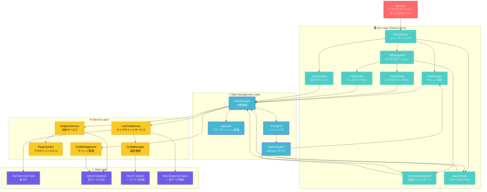
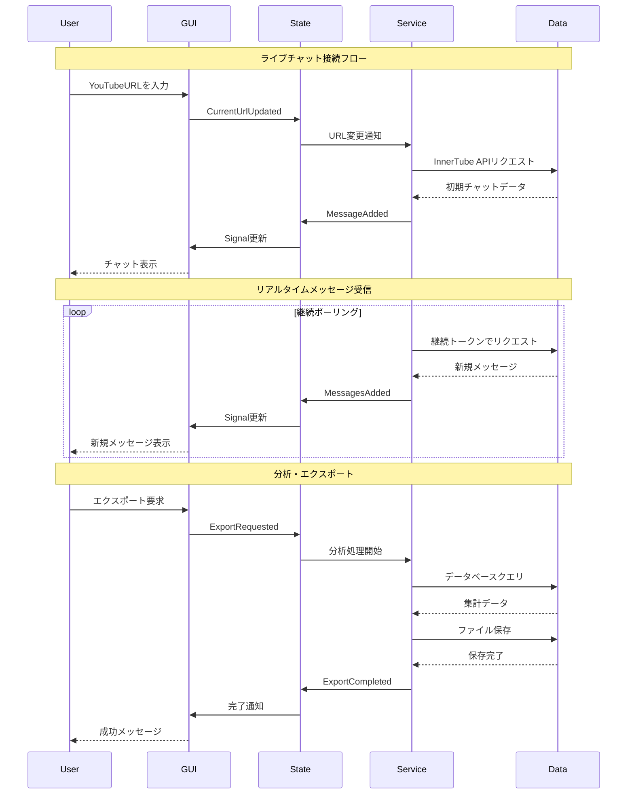
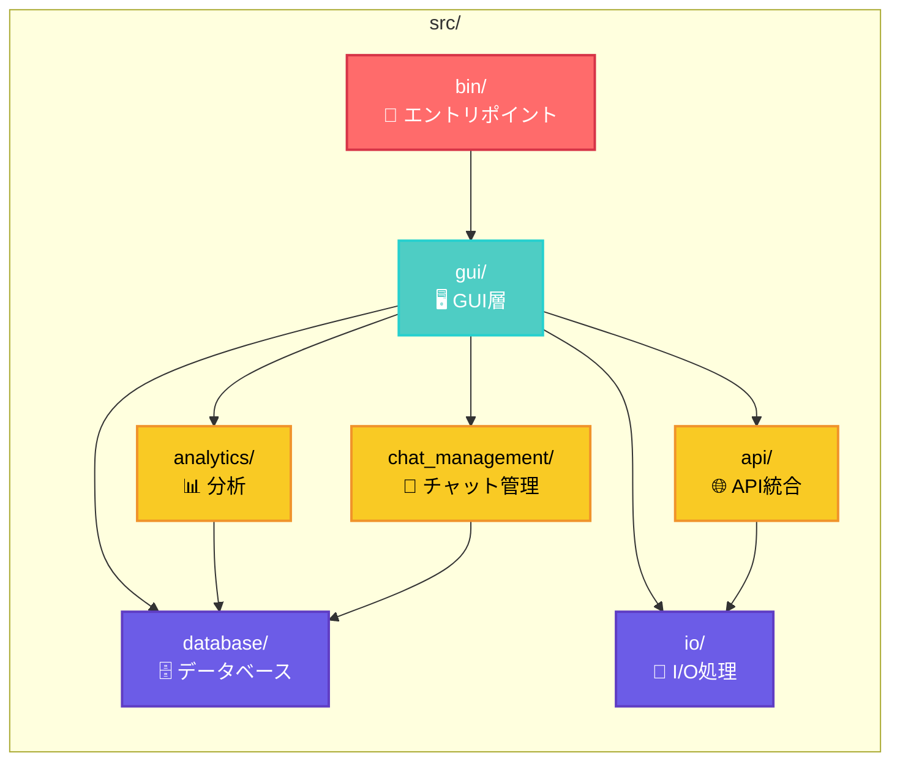
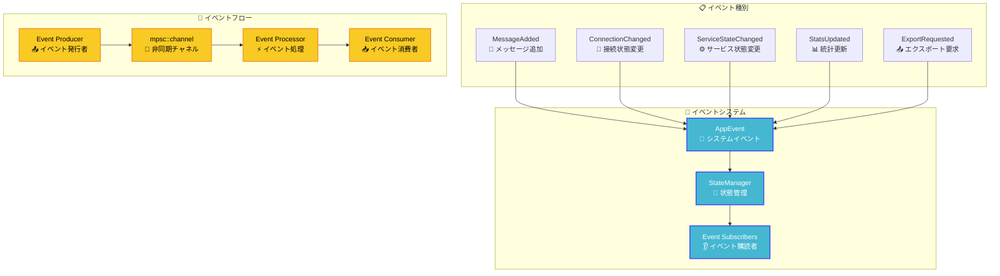
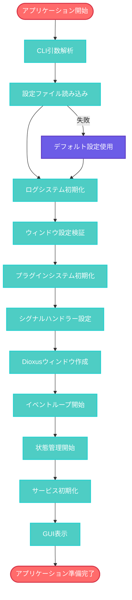

# liscov システム全体アーキテクチャ

## 📊 システム概要

liscovは4つの主要レイヤーから構成される階層化アーキテクチャを採用しています：

1. **Presentation Layer** (GUI - Dioxus 0.6.3)
2. **State Management Layer** (イベント駆動状態管理)
3. **Service Layer** (ビジネスロジック・API統合)
4. **Data Layer** (永続化・外部API)

## 🏗️ 全体アーキテクチャ図

## 🔄 データフロー図

## 🧩 モジュール相互関係

## 🔌 イベント駆動アーキテクチャ

## 🚀 アプリケーション起動フロー

## 📈 パフォーマンス考慮事項

### メモリ管理戦略

- **循環バッファ**: 最大1000メッセージのメモリ制限
- **バッチ処理**: 大量メッセージの効率的処理
- **レイジーローディング**: 必要時のみデータロード

### 非同期処理最適化

- **Tokio Runtime**: マルチスレッド非同期実行
- **Channel-based Communication**: コンポーネント間通信
- **背景タスク**: UI阻害なしのデータ処理

### レスポンシブネス

- **Dioxus Signals**: リアクティブUI更新
- **イベント駆動**: 効率的状態変更通知
- **プログレッシブレンダリング**: 段階的UI描画

---

**最終更新**: 2025-06-25  
**対象バージョン**: 0.1.0  
**アーキテクチャレベル**: System Overview
