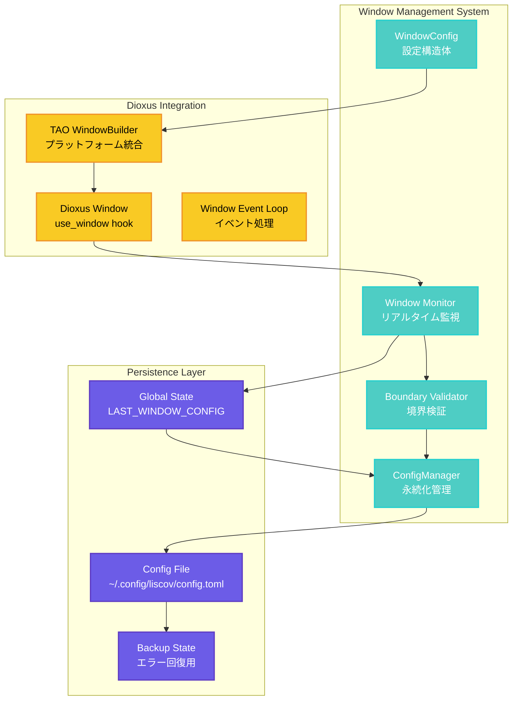

# liscov ウィンドウ管理・状態保存システム

## 📖 概要

liscovのウィンドウ管理システムは、**永続的なウィンドウ状態管理**と**リアルタイム状態監視**を組み合わせた高度なウィンドウ体験を提供します。ユーザーの作業環境を記憶し、アプリケーション再起動時に正確に復元します。

## 🏗️ ウィンドウ管理アーキテクチャ



## 🪟 WindowConfig構造体

### 基本設定構造

```rust
use serde::{Deserialize, Serialize};

#[derive(Debug, Clone, Serialize, Deserialize, PartialEq)]
pub struct WindowConfig {
    /// ウィンドウ幅（ピクセル）
    pub width: u32,
    /// ウィンドウ高さ（ピクセル）
    pub height: u32,
    /// ウィンドウX座標
    pub x: i32,
    /// ウィンドウY座標
    pub y: i32,
    /// 最大化状態
    pub maximized: bool,
    /// 常に最前面表示
    #[serde(default)]
    pub always_on_top: bool,
    /// リサイズ可能
    #[serde(default = "default_resizable")]
    pub resizable: bool,
    /// 最小サイズ
    #[serde(default)]
    pub min_size: Option<(u32, u32)>,
    /// 最大サイズ
    #[serde(default)]
    pub max_size: Option<(u32, u32)>,
}

fn default_resizable() -> bool { true }

impl Default for WindowConfig {
    fn default() -> Self {
        Self {
            width: 1200,
            height: 800,
            x: 100,
            y: 100,
            maximized: false,
            always_on_top: false,
            resizable: true,
            min_size: Some((640, 480)),
            max_size: None,
        }
    }
}
```

### ウィンドウ状態の検証

```rust
impl WindowConfig {
    /// ウィンドウ設定の妥当性を検証
    pub fn validate(&self) -> Result<(), Vec<ValidationError>> {
        let mut errors = Vec::new();
        
        // サイズ制約の検証
        if self.width < 640 {
            errors.push(ValidationError::WindowTooSmall { 
                dimension: "width".to_string(), 
                value: self.width, 
                minimum: 640 
            });
        }
        
        if self.height < 480 {
            errors.push(ValidationError::WindowTooSmall { 
                dimension: "height".to_string(), 
                value: self.height, 
                minimum: 480 
            });
        }
        
        // 最大サイズの妥当性チェック
        if self.width > 7680 || self.height > 4320 {
            errors.push(ValidationError::WindowTooLarge {
                width: self.width,
                height: self.height,
            });
        }
        
        // 最小・最大サイズの整合性
        if let Some((min_w, min_h)) = self.min_size {
            if self.width < min_w || self.height < min_h {
                errors.push(ValidationError::SizeConstraintViolation);
            }
        }
        
        if let Some((max_w, max_h)) = self.max_size {
            if self.width > max_w || self.height > max_h {
                errors.push(ValidationError::SizeConstraintViolation);
            }
        }
        
        if errors.is_empty() { Ok(()) } else { Err(errors) }
    }
    
    /// スクリーン境界内にウィンドウを調整
    pub fn fit_to_screen(&mut self) -> Result<(), WindowError> {
        let monitors = get_available_monitors()?;
        let primary_monitor = monitors.into_iter()
            .find(|m| m.is_primary())
            .ok_or(WindowError::NoPrimaryMonitor)?;
            
        let screen_rect = primary_monitor.work_area();
        
        // ウィンドウサイズがスクリーンより大きい場合は調整
        if self.width > screen_rect.width {
            self.width = screen_rect.width.saturating_sub(100);
        }
        if self.height > screen_rect.height {
            self.height = screen_rect.height.saturating_sub(100);
        }
        
        // ウィンドウ位置がスクリーン外の場合は調整
        if self.x < screen_rect.x || self.x + self.width as i32 > screen_rect.x + screen_rect.width as i32 {
            self.x = screen_rect.x + 50;
        }
        if self.y < screen_rect.y || self.y + self.height as i32 > screen_rect.y + screen_rect.height as i32 {
            self.y = screen_rect.y + 50;
        }
        
        Ok(())
    }
}
```

## 🔍 リアルタイム状態監視

### ウィンドウ監視システム

```rust
/// ウィンドウ設定の保存用グローバル状態
static LAST_WINDOW_CONFIG: Mutex<Option<WindowConfig>> = Mutex::new(None);

/// ウィンドウ状態を1秒間隔で監視
pub fn start_window_monitoring(window: dioxus::desktop::DesktopContext) {
    use_effect({
        let window = window.clone();
        move || {
            let window = window.clone();
            spawn(async move {
                let mut interval = tokio::time::interval(tokio::time::Duration::from_secs(1));
                loop {
                    interval.tick().await;

                    // ウィンドウの現在状態を取得
                    let current_state = capture_window_state(&window);
                    
                    match current_state {
                        Ok(state) => {
                            // グローバル状態を更新
                            if let Ok(mut last_config) = LAST_WINDOW_CONFIG.lock() {
                                *last_config = Some(state);
                            }
                        },
                        Err(e) => {
                            tracing::debug!("⚠️ Window state capture failed: {}", e);
                        }
                    }
                }
            });
        }
    });
}

/// 現在のウィンドウ状態をキャプチャ
fn capture_window_state(window: &dioxus::desktop::DesktopContext) -> Result<WindowConfig, WindowError> {
    let current_size = window.inner_size();
    let current_position = window.outer_position()
        .map_err(|_| WindowError::PositionUnavailable)?;
    let is_maximized = window.is_maximized();
    let is_resizable = window.is_resizable();
    
    Ok(WindowConfig {
        width: current_size.width,
        height: current_size.height,
        x: current_position.x,
        y: current_position.y,
        maximized: is_maximized,
        resizable: is_resizable,
        always_on_top: false, // 現在の実装では固定値
        min_size: Some((640, 480)),
        max_size: None,
    })
}
```

### 状態変更の検出と最適化

```rust
pub struct WindowStateTracker {
    last_saved_state: Option<WindowConfig>,
    change_threshold: std::time::Duration,
    last_change_time: std::time::Instant,
}

impl WindowStateTracker {
    pub fn new() -> Self {
        Self {
            last_saved_state: None,
            change_threshold: std::time::Duration::from_secs(2),
            last_change_time: std::time::Instant::now(),
        }
    }
    
    /// 状態変更を検出し、必要な場合のみ保存
    pub fn should_save_state(&mut self, current_state: &WindowConfig) -> bool {
        // 前回の保存から十分時間が経過しているか
        if self.last_change_time.elapsed() < self.change_threshold {
            return false;
        }
        
        // 状態に意味のある変更があるか
        if let Some(ref last_state) = self.last_saved_state {
            if self.states_essentially_equal(last_state, current_state) {
                return false;
            }
        }
        
        self.last_saved_state = Some(current_state.clone());
        self.last_change_time = std::time::Instant::now();
        true
    }
    
    /// 状態の実質的な同一性を判定
    fn states_essentially_equal(&self, a: &WindowConfig, b: &WindowConfig) -> bool {
        // 小さな位置変更は無視（ピクセル単位の微調整）
        let position_threshold = 5;
        let size_threshold = 10;
        
        (a.x - b.x).abs() <= position_threshold &&
        (a.y - b.y).abs() <= position_threshold &&
        a.width.abs_diff(b.width) <= size_threshold &&
        a.height.abs_diff(b.height) <= size_threshold &&
        a.maximized == b.maximized
    }
}
```

## 🏗️ Dioxus統合

### ウィンドウビルダー設定

```rust
/// Dioxus LaunchBuilderにウィンドウ設定を適用
pub fn apply_window_config(
    builder: dioxus::LaunchBuilder<dioxus::desktop::Config>, 
    config: &WindowConfig
) -> dioxus::LaunchBuilder<dioxus::desktop::Config> {
    
    let window_builder = dioxus::desktop::tao::window::WindowBuilder::new()
        .with_title("liscov - YouTube Live Chat Monitor")
        .with_inner_size(dioxus::desktop::tao::dpi::LogicalSize::new(
            config.width as f64,
            config.height as f64,
        ))
        .with_position(dioxus::desktop::tao::dpi::LogicalPosition::new(
            config.x as f64,
            config.y as f64,
        ))
        .with_maximized(config.maximized)
        .with_resizable(config.resizable);
    
    // 最小サイズの設定
    let window_builder = if let Some((min_w, min_h)) = config.min_size {
        window_builder.with_min_inner_size(dioxus::desktop::tao::dpi::LogicalSize::new(
            min_w as f64,
            min_h as f64,
        ))
    } else {
        window_builder
    };
    
    // 最大サイズの設定
    let window_builder = if let Some((max_w, max_h)) = config.max_size {
        window_builder.with_max_inner_size(dioxus::desktop::tao::dpi::LogicalSize::new(
            max_w as f64,
            max_h as f64,
        ))
    } else {
        window_builder
    };
    
    builder.with_cfg(
        dioxus::desktop::Config::new()
            .with_window(window_builder)
    )
}
```

### ウィンドウイベント処理

```rust
#[component]
pub fn WindowEventHandler() -> Element {
    let window = dioxus::desktop::use_window();
    
    // ウィンドウリサイズイベント
    use_effect({
        let window = window.clone();
        move || {
            // リサイズイベントの処理
            spawn(async move {
                // ウィンドウサイズ変更の監視
                // 実装は省略...
            });
        }
    });
    
    // ウィンドウ移動イベント
    use_effect({
        let window = window.clone();
        move || {
            // 位置変更イベントの処理
            spawn(async move {
                // ウィンドウ位置変更の監視
                // 実装は省略...
            });
        }
    });
    
    rsx! {
        // WindowEventHandlerは見た目なしの機能コンポーネント
        div { style: "display: none;" }
    }
}
```

## 💾 永続化システム

### 設定保存の実装

```rust
/// 終了時にウィンドウ設定を保存
pub fn save_window_config_on_exit() {
    if let Ok(last_config_guard) = LAST_WINDOW_CONFIG.lock() {
        if let Some(window_config) = last_config_guard.as_ref() {
            match save_window_config_internal(window_config) {
                Ok(_) => {
                    tracing::info!(
                        "💾 ウィンドウ設定を保存しました: {}x{} at ({}, {}), 最大化: {}",
                        window_config.width,
                        window_config.height,
                        window_config.x,
                        window_config.y,
                        window_config.maximized
                    );
                },
                Err(e) => {
                    tracing::error!("❌ ウィンドウ設定保存エラー: {}", e);
                }
            }
        } else {
            tracing::warn!("⚠️ 保存する最新のウィンドウ設定が見つかりませんでした");
        }
    } else {
        tracing::error!("❌ ウィンドウ設定のミューテックスがポイズンされています");
    }
}

fn save_window_config_internal(window_config: &WindowConfig) -> Result<(), WindowError> {
    // 新しいConfigManagerインスタンスを作成
    let config_manager = config_manager::ConfigManager::new()
        .map_err(|e| WindowError::ConfigManagerCreation(e.to_string()))?;
    
    // 既存の設定を読み込み、ウィンドウ設定のみ更新
    let mut config = config_manager.load_config()
        .unwrap_or_else(|_| config_manager::AppConfig::default());
    
    config.window = window_config.clone();
    
    // 設定を保存
    config_manager.save_config(&config)
        .map_err(|e| WindowError::ConfigSave(e.to_string()))?;
    
    Ok(())
}
```

### バックアップとリストア

```rust
pub struct WindowConfigBackup {
    primary_config: WindowConfig,
    backup_configs: Vec<WindowConfig>,
    last_known_good: Option<WindowConfig>,
}

impl WindowConfigBackup {
    /// 設定のバックアップを作成
    pub fn create_backup(config: &WindowConfig) -> Self {
        Self {
            primary_config: config.clone(),
            backup_configs: vec![WindowConfig::default()],
            last_known_good: Some(config.clone()),
        }
    }
    
    /// 破損した設定から回復
    pub fn recover_from_corruption(&self) -> WindowConfig {
        // 1. 最後に正常だった設定を試行
        if let Some(ref last_good) = self.last_known_good {
            if last_good.validate().is_ok() {
                tracing::info!("🔧 最後に正常だった設定から復旧");
                return last_good.clone();
            }
        }
        
        // 2. バックアップ設定を試行
        for backup in &self.backup_configs {
            if backup.validate().is_ok() {
                tracing::info!("🔧 バックアップ設定から復旧");
                return backup.clone();
            }
        }
        
        // 3. 最後の手段：デフォルト設定
        tracing::warn!("🔧 デフォルト設定で復旧");
        WindowConfig::default()
    }
}
```

## 🖥️ マルチモニター対応

### モニター情報の取得

```rust
use dioxus::desktop::tao::monitor::{MonitorHandle, VideoMode};

#[derive(Debug, Clone)]
pub struct MonitorInfo {
    pub handle: MonitorHandle,
    pub name: Option<String>,
    pub size: (u32, u32),
    pub position: (i32, i32),
    pub scale_factor: f64,
    pub is_primary: bool,
}

pub fn get_available_monitors() -> Result<Vec<MonitorInfo>, WindowError> {
    // 注意: この関数は実際のDioxus/TAOの実装に依存
    // 現在の実装では簡略化されています
    
    let monitors = vec![
        MonitorInfo {
            handle: /* 実際のハンドル */,
            name: Some("Primary Monitor".to_string()),
            size: (1920, 1080),
            position: (0, 0),
            scale_factor: 1.0,
            is_primary: true,
        }
    ];
    
    Ok(monitors)
}

/// ウィンドウが表示されるべきモニターを決定
pub fn determine_target_monitor(config: &WindowConfig) -> Option<MonitorInfo> {
    let monitors = get_available_monitors().ok()?;
    
    // ウィンドウ中心点を計算
    let center_x = config.x + (config.width as i32) / 2;
    let center_y = config.y + (config.height as i32) / 2;
    
    // ウィンドウ中心点が含まれるモニターを探す
    for monitor in monitors {
        let monitor_right = monitor.position.0 + monitor.size.0 as i32;
        let monitor_bottom = monitor.position.1 + monitor.size.1 as i32;
        
        if center_x >= monitor.position.0 && center_x < monitor_right &&
           center_y >= monitor.position.1 && center_y < monitor_bottom {
            return Some(monitor);
        }
    }
    
    None
}
```

### モニター間でのウィンドウ移動

```rust
impl WindowConfig {
    /// 指定されたモニターにウィンドウを移動
    pub fn move_to_monitor(&mut self, monitor: &MonitorInfo) -> Result<(), WindowError> {
        // 現在のモニターを特定
        let current_monitor = determine_target_monitor(self)
            .unwrap_or_else(|| MonitorInfo {
                handle: /* デフォルトハンドル */,
                name: Some("Unknown".to_string()),
                size: (1920, 1080),
                position: (0, 0),
                scale_factor: 1.0,
                is_primary: true,
            });
        
        // 相対位置を計算
        let rel_x = self.x - current_monitor.position.0;
        let rel_y = self.y - current_monitor.position.1;
        
        // 新しいモニターでの絶対位置を計算
        self.x = monitor.position.0 + rel_x;
        self.y = monitor.position.1 + rel_y;
        
        // ウィンドウが新しいモニターの境界内にあることを確認
        self.fit_to_monitor_bounds(monitor)?;
        
        Ok(())
    }
    
    fn fit_to_monitor_bounds(&mut self, monitor: &MonitorInfo) -> Result<(), WindowError> {
        let monitor_right = monitor.position.0 + monitor.size.0 as i32;
        let monitor_bottom = monitor.position.1 + monitor.size.1 as i32;
        
        // ウィンドウがモニター境界を超えないよう調整
        if self.x + self.width as i32 > monitor_right {
            self.x = monitor_right - self.width as i32;
        }
        if self.y + self.height as i32 > monitor_bottom {
            self.y = monitor_bottom - self.height as i32;
        }
        
        // ウィンドウがモニター境界内に完全に収まるよう調整
        if self.x < monitor.position.0 {
            self.x = monitor.position.0;
        }
        if self.y < monitor.position.1 {
            self.y = monitor.position.1;
        }
        
        Ok(())
    }
}
```

## 🔄 状態同期と一貫性

### 状態同期の実装

```rust
pub struct WindowStateSynchronizer {
    state_manager: Arc<StateManager>,
    config_manager: Arc<ConfigManager>,
    last_sync: Mutex<std::time::Instant>,
}

impl WindowStateSynchronizer {
    pub fn new(
        state_manager: Arc<StateManager>,
        config_manager: Arc<ConfigManager>
    ) -> Self {
        Self {
            state_manager,
            config_manager,
            last_sync: Mutex::new(std::time::Instant::now()),
        }
    }
    
    /// アプリケーション状態とウィンドウ設定を同期
    pub async fn synchronize_state(&self) -> Result<(), WindowError> {
        let current_window_state = self.get_current_window_state().await?;
        let app_state = self.state_manager.get_state()?;
        
        // 状態の不整合を検出
        if self.detect_inconsistency(&current_window_state, &app_state) {
            tracing::info!("🔄 State inconsistency detected, synchronizing...");
            self.resolve_inconsistency(current_window_state, app_state).await?;
        }
        
        // 同期時刻を更新
        if let Ok(mut last_sync) = self.last_sync.lock() {
            *last_sync = std::time::Instant::now();
        }
        
        Ok(())
    }
    
    async fn resolve_inconsistency(
        &self,
        window_state: WindowConfig,
        app_state: AppState
    ) -> Result<(), WindowError> {
        // ウィンドウ状態を信頼できるソースとして使用
        let mut updated_config = self.config_manager.load_config()?;
        updated_config.window = window_state;
        
        // 設定を保存
        self.config_manager.save_config(&updated_config)?;
        
        // アプリケーション状態にも反映
        self.state_manager.send_event(AppEvent::WindowStateUpdated(window_state))?;
        
        Ok(())
    }
}
```

## 📊 パフォーマンス最適化

### 監視頻度の動的調整

```rust
pub struct AdaptiveWindowMonitor {
    monitoring_interval: std::time::Duration,
    activity_detector: WindowActivityDetector,
    last_activity: std::time::Instant,
}

impl AdaptiveWindowMonitor {
    /// ウィンドウアクティビティに基づいて監視頻度を調整
    pub fn adjust_monitoring_frequency(&mut self) {
        let time_since_activity = self.last_activity.elapsed();
        
        // アクティブ時は高頻度、非アクティブ時は低頻度
        self.monitoring_interval = if time_since_activity < std::time::Duration::from_secs(10) {
            std::time::Duration::from_millis(500) // 高頻度：0.5秒
        } else if time_since_activity < std::time::Duration::from_secs(60) {
            std::time::Duration::from_secs(2)    // 中頻度：2秒
        } else {
            std::time::Duration::from_secs(5)    // 低頻度：5秒
        };
    }
}

pub struct WindowActivityDetector {
    last_size: (u32, u32),
    last_position: (i32, i32),
    change_threshold: u32,
}

impl WindowActivityDetector {
    pub fn detect_activity(&mut self, current_config: &WindowConfig) -> bool {
        let size_changed = 
            self.last_size.0.abs_diff(current_config.width) > self.change_threshold ||
            self.last_size.1.abs_diff(current_config.height) > self.change_threshold;
            
        let position_changed =
            (self.last_position.0 - current_config.x).abs() > self.change_threshold as i32 ||
            (self.last_position.1 - current_config.y).abs() > self.change_threshold as i32;
        
        if size_changed || position_changed {
            self.last_size = (current_config.width, current_config.height);
            self.last_position = (current_config.x, current_config.y);
            true
        } else {
            false
        }
    }
}
```

## 🛡️ エラー処理とフォールバック

### 包括的エラー処理

```rust
#[derive(Debug, thiserror::Error)]
pub enum WindowError {
    #[error("Position unavailable from window system")]
    PositionUnavailable,
    
    #[error("No primary monitor found")]
    NoPrimaryMonitor,
    
    #[error("Window validation failed: {errors:?}")]
    ValidationFailed { errors: Vec<ValidationError> },
    
    #[error("Config manager creation failed: {0}")]
    ConfigManagerCreation(String),
    
    #[error("Config save failed: {0}")]
    ConfigSave(String),
    
    #[error("Monitor detection failed: {0}")]
    MonitorDetection(String),
    
    #[error("Window system error: {0}")]
    SystemError(String),
}

/// ウィンドウエラーからの回復処理
pub fn recover_from_window_error(error: &WindowError) -> WindowConfig {
    match error {
        WindowError::PositionUnavailable => {
            tracing::warn!("📍 ウィンドウ位置が取得できません、センターに配置");
            let mut config = WindowConfig::default();
            config.x = 100;
            config.y = 100;
            config
        },
        
        WindowError::NoPrimaryMonitor => {
            tracing::warn!("🖥️ プライマリモニターが見つかりません、デフォルト設定使用");
            WindowConfig::default()
        },
        
        WindowError::ValidationFailed { errors } => {
            tracing::error!("❌ ウィンドウ設定検証失敗: {:?}, デフォルト設定使用", errors);
            WindowConfig::default()
        },
        
        _ => {
            tracing::error!("❌ 予期しないウィンドウエラー: {}, デフォルト設定使用", error);
            WindowConfig::default()
        }
    }
}
```

---

**最終更新**: 2025-06-25  
**対象バージョン**: 0.1.0  
**アーキテクチャレベル**: Window Management System  
**関連ファイル**: `src/bin/liscov.rs`, `src/gui/config_manager.rs`
